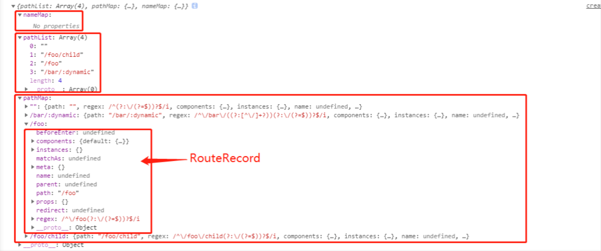
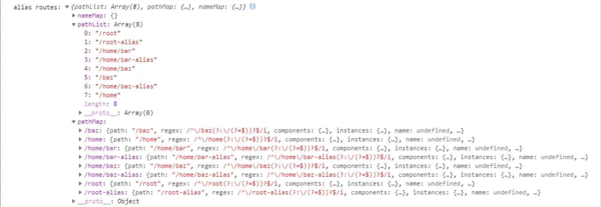

# vue-router 源码阅读

当前阅读的 vue-router 版本 3.1.6。基本源码目录结构：

```
Vue-Router
├── src                         源码目录
│   ├── components              vue-router 提供的组件
│   │   ├── link.js             <router-link /> 组件
│   │   └── view.js             <router-view /> 组件
│   ├── history                 路由的封装方式
│   │   ├── abstract.js         非浏览器环境下的，抽象路由模式
│   │   ├── base.js             定义 History 基类
│   │   ├── hash.js             hash 模式，#
│   │   └── html5.js            html5 history 模式
│   ├── create-matcher.js       路由匹配规则
│   ├── create-route-map.js     路由匹配规则
│   ├── index.js                声明 VueRouter 构造函数，并导出
│   ├── install.js              定义 VueRouter 通过插件安装到 Vue 上
│   ├── util                    各种功能函数
│   │   ├── async.js            
│   │   ├── dom.js            
│   │   ├── errors.js             
│   │   ├── location.js
│   │   ├── misc.js
│   │   ├── params.js
│   │   ├── path.js
│   │   ├── push-state.js
│   │   ├── query.js
│   │   ├── resolve-components.js
│   │   ├── route.js
│   │   ├── scroll.js
│   │   ├── state-key.js
│   │   └── warn.js
```


## 1、前置知识

在阅读 vue-router 源码之前，先来了解一下 hash 和 histroy 相关的知识。


### 1-1、hash


#### 1-1-1、浏览器 url 中的 hash

浏览器中 URL 的 hash，比如：

```js
http://www.example.com/#home
```

#后面的就是 url 的 hash，比如这里的 #home

hash 的特点：hash 虽然出现在 URL 中，但不会被包括在 HTTP 请求中，对后端完全没有影响，因此改变 hash 不会重新加载页面。

改变#后的部分，浏览器只会滚动到相应位置（如果存在该节点），不会重新加载网页。

每一次改变#后的部分，都会在浏览器的访问历史中增加一个记录，使用浏览器"后退"按钮，就可以回到上一个位置。


#### 1-2-2、读取 hash 值

可以通过：

```js
window.location.hash
```

读取浏览器 url 中的 hash 值


#### 1-1-3、监听 hash 变化

可以通过 **window.onhashchange 事件** 监听浏览器 url 的 hash 值的变化：这是一个 HTML5 新增的事件，当 hash 值发生变化时，就会触发该事件

```js
window.addEventListener('hashchange', () => {
   // 监听 hash 变化，读取最新的 hash 值
   console.log(window.location.hash)
})
```


### 1-2、history

HTML5 为浏览器的 history 对象新增了两个方法：history.pushState() 和 history.replaceState()，用来在浏览历史中添加和修改记录。这两个方法都可以**修改浏览器的 url 地址而无须重新加载页面**。


这两者的区别：

- pushState：会在浏览器 history 栈中添加一个新的记录
- replaceState：会在浏览器 history 栈中修改历史记录项而不是新建一个


#### 1-2-1、pushState  用法

```js
window.history.pushState(state,title,url)
```

- state：需要保存的数据，这个数据在触发 popstate 事件时，可以在 event.state 里获取
- title：标题，基本没用，一般传 null
- url：设定新的历史纪录的 url。新的 url 与当前 url 的 origin 必须是一样的，否则会抛出错误。url可以是绝对路径，也可以是相对路径。如当前url是 https://www.baidu.com/a/ （注意，开启本地服务测试：127.0.0.1，不要使用 file:// 协议）
  - 执行 history.pushState(null, null, './qq/')，变成 https://www.baidu.com/a/qq/
  - 执行history.pushState(null, null, '/qq/')，变成 https://www.baidu.com/qq/

使用实例：

```js
history.pushState({ page: 1 }, null, "?page=1")
```


#### 1-2-2、replaceState 使用

```js
window.history.replaceState(state,title,url)
```

参数与 pushState 的一样，不一样的地方是：replaceState 是修改当前历史纪录，而 pushState 是创建新的历史纪录


#### 1-2-3、popstate 监听

通过 popstate 进行监听：

```js
window.addEventListener('popstate', (event) => {
  console.log('触发了 popstate')
  console.log(event.state)
})
```

注意：**仅仅调用 pushState 方法或 replaceState 方法，并不会触发该事件**，只有用户**点击浏览器后退和前进按钮时**，或者使用 js 调用history.back、history.forward、history.go 方法时才会触发


## 2、vue-router 的注册

接下来，看看 vue-router 是怎么被注册到 vue 上的。


平时在使用 `vue-router` 的时候通常需要在 `main.js` 中初始化 `Vue` 实例时将 `vue-router` 实例对象当做参数传入

```js
import Vue from 'vue'
import VueRouter from 'vue-router'
import Home from './views/Home.vue'

Vue.use(VueRouter)

export default new VueRouter({
  mode: 'history',
  base: process.env.BASE_URL,
  routes: [
    {
      path: '/',
      name: 'home',
      component: Home
    },
    {
      path: '/about',
      name: 'about',
      component: () => import(/* webpackChunkName: "about" */ './views/About.vue')
    }
  ]
})
```

```js
import Vue from 'vue'
import router from './router'

let a = new Vue({
  router,
  render: h => h(App)
}).$mount('#app')
```


### 2-1、Vue.use()

在使用的时候，会通过 `Vue.use(Router)` 的形式将 vue-router 当做插件安装到 vue 身上，来看看 vue 源码是怎么定义 Vue.use 的：

```js
// 用于安装 vue 插件：
//   1、检查插件是否安装，如果安装了就不再安装
//   2、如果没有没有安装，安装插件，执行插件的 install 方法
export function initUse(Vue: GlobalAPI) {
  // 接受一个 plugin 参数
  Vue.use = function (plugin: Function | Object) {
    // this 就是 Vue 本身
    // _installedPlugins 存储了所有 plugin
    // installedPlugins 与 this._installedPlugins 指向同一个数组
    // 那么只要 installedPlugins 或者 this._installedPlugins 其中一个改变，肯定会影响另外一个
    const installedPlugins =
      this._installedPlugins || (this._installedPlugins = []);

    // 如果 plugin 在 installedPlugins 已存在，那么返回 Vue（说明安装过，不再重复安装）
    if (installedPlugins.indexOf(plugin) > -1) {
      return this;
    }

    // additional parameters
    const args = toArray(arguments, 1);
    // 将 Vue 实例放到参数数组的首位，后面将这些参数传递给 install 方法
    args.unshift(this);

    if (typeof plugin.install === "function") {
      // plugin 是对象形式，执行 plugin.install, args 的第一项就是 Vue
      plugin.install.apply(plugin, args);
    } else if (typeof plugin === "function") {
      // plugin 是函数形式，直接将 plugin 本身当做 install 来执行
      plugin.apply(null, args);
    }

    // 在插件列表 installedPlugins 和 vue._installedPlugins 中添加新安装的插件
    // 因为上面说过 installedPlugins 和 vue._installedPlugins 指向同一个数组
    installedPlugins.push(plugin);

    // 返回 this（即 Vue）
    return this;
  };
}
```

基本上，Vue.use 做的事：

- 检查插件是否安装，如果安装了就不再安装

- 如果没有没有安装，安装插件，执行插件的 install 方法

- 将已安装过的插件保存到 `vue._installedPlugins` 中


### 2-2、install

由 Vue.use 可知，`Vue` 注册插件其实就是在执行插件的 `install` 方法，那么 vue-router 也需要一个 install 方法

> vue-router\src\index.js

```js
import { install } from './install'

export default class VueRouter {
  static install: () => void;

  // ...
}

VueRouter.install = install
```

明显，定义了 VueRouter 类，并且往 VueRouter 类上挂载 install 方法，接下来看看这个 install


> vue-router\src\install.js

```js
import View from './components/view'
import Link from './components/link'

// 保存 Vue 的局部变量，并导出，使 vue-router 在任何地方都能访问到 Vue
export let _Vue

export function install (Vue) {
  // 如果是多次注册，就会 return 不会进行重复的注册
  if (install.installed && _Vue === Vue) return
  // install.installed = true 代表已经注册过
  install.installed = true

  // 因为在上面通过 export let _Vue 将 Vue 导出，使 vue-router 在任何时候都能访问到 Vue
  // 好处: 在其它模块中，可以导入这个 _Vue，这样既能访问到 Vue，又避免了将 Vue 做为依赖打包
  _Vue = Vue

  const isDef = v => v !== undefined

  const registerInstance = (vm, callVal) => {
    let i = vm.$options._parentVnode
    if (isDef(i) && isDef(i = i.data) && isDef(i = i.registerRouteInstance)) {
      i(vm, callVal)
    }
  }

  // 通过 Vue.mixin 去做全局混入，通过全局混入使得每一个组件
  // 当组件实例化执行到 beforeCreate、destroyed 钩子时都会执行这里定义的逻辑
  Vue.mixin({
    beforeCreate () {
      // 判断是否在 new Vue 的时候是否把 router 传入
      // 传进来了，会在 Vue.$options 上挂载有 router
      // new Vue({ el: 'app', router })
      if (isDef(this.$options.router)) {
        // 将 Vue 赋值给 this._routerRoot 
        this._routerRoot = this
        // 将传入的 router 赋值给 this._router
        this._router = this.$options.router 
        // 传入的 router 是通过 new VueRouter({mode: '', routes: [{}]}) 出来的
        // VueRouter 类身上有 init 方法，主要是进行 VueRouter 的初始化
        // 将 this 当做参数，this 是 vue
        this._router.init(this)
        // 将 _route 变成响应式的
        Vue.util.defineReactive(this, '_route', this._router.history.current)
      } else {
        this._routerRoot = (this.$parent && this.$parent._routerRoot) || this
      }
      registerInstance(this, this)
    },
    destroyed () {
      registerInstance(this)
    }
  })

  // 通过 Object.defineProperty 代理的方式往 Vue 原型上加入 $router 实例
  // 这样在使用的时候可以通过 this.$router 访问
  Object.defineProperty(Vue.prototype, '$router', {
    get () { return this._routerRoot._router }
  })

  // 通过 Object.defineProperty 代理的方式往 Vue 原型上加入 $route
  // 这样在使用的时候可以通过 this.$route 访问
  Object.defineProperty(Vue.prototype, '$route', {
    get () { return this._routerRoot._route }
  })

  // 全局注册 router-view 和 router-link 这两个组件
  Vue.component('RouterView', View)
  Vue.component('RouterLink', Link)

  // 设置路由组件的 beforeRouteEnter、beforeRouteLeave、beforeRouteUpdate 守卫的合并策略
  const strats = Vue.config.optionMergeStrategies
  // use the same hook merging strategy for route hooks
  strats.beforeRouteEnter = strats.beforeRouteLeave = strats.beforeRouteUpdate = strats.created
}

```

-   判断是否注册过，如果注册过不会再重新注册
-   \_Vue = Vue 将 Vue 保存，并导出 \_Vue，使 vue-router 在任何时候都能访问到 Vue
-   通过 Vue.mixin 全局混入，通过全局混入使得每一个组件执行 beforeCreate、destroyed 都会执行这里的 beforeCreate、destroyed 定义的逻辑；beforeCreate 中会判断是否在 new Vue 的时候是否传入 router，`new Vue({ el: 'app', router })`。当组件实例化执行到 beforeCreate 会调用 `this._router.init(this)` 进行 vue-router 的初始化。
-   往 Vue 原型上注入 $router 与 $route，这样在使用的时候可以通过 this.$router、this.$route 的方式方便调用
-   全局注册 router-view 和 router-link 这两个组件
-   设置路由组件的 beforeRouteEnter、beforeRouteLeave、beforeRouteUpdate 守卫的合并策略


## 3、VueRouter


### 3-1、VueRouter 的实例化


#### 3-1-1、new VueRouter 的过程

VueRouter 的实例化的过程就是 new VueRouter 执行构造器函数 constructor 的过程：

> vue-router\src\index.js

```js
export default class VueRouter {
  constructor (options: RouterOptions = {}) {
    this.app = null
    this.apps = []
    this.options = options
    this.beforeHooks = []
    this.resolveHooks = []
    this.afterHooks = []

    // 创建路由 matcher 对象
    // 主要用来处理传进来的路由配置 routes 的，创建路由配置表匹配器
    // new VueRouter({ routes: [{ path: '/', component: Home }] })
    this.matcher = createMatcher(options.routes || [], this)

    // new VueRouter 的时候是否传入 mode，没有默认使用 hash 模式
    let mode = options.mode || 'hash'

    // 如果使用 history 模式，会做一层判断
    // 判断当前环境支不支持 history 模式，不支持会被强制转换到 hash 模式（降级处理）
    this.fallback = mode === 'history' && !supportsPushState && options.fallback !== false
    if (this.fallback) {
      mode = 'hash'
    }

    // 不是浏览器环境，会切换到 abstract 模式
    if (!inBrowser) {
      mode = 'abstract'
    }

    this.mode = mode

    // 根据不同 mode，实例化不同 history 实例，并将 history 实例挂载到 VueRouter 类上的 history  属性中
    // 上面会判断，如果不传 mode，mode 默认为 hash
    switch (mode) {
      case 'history':
        this.history = new HTML5History(this, options.base)
        break
      case 'hash':
        // this.fallback：
        //  当浏览器不支持 history.pushState 控制路由是否应该回退到 hash 模式。默认值为 true
        //  可以在 new VueRouter 时可以手动传进来
        this.history = new HashHistory(this, options.base, this.fallback)
        break
      case 'abstract':
        this.history = new AbstractHistory(this, options.base)
        break
      default:
        if (process.env.NODE_ENV !== 'production') {
          assert(false, `invalid mode: ${mode}`)
        }
    }
  }
}
```

-   根据传进来的路由配置表 routes，createMatcher 创建路由配置表匹配器（下面路由跳转的时候再分析这个创建过程）
-   如果没有传入 mode，默认使用 hash 模式；如果当前环境不支持 history 模式，会强制切换到 hash 模式；如果当前环境不是浏览器环境，会切换到 abstract 模式下。
-   根据不同 mode，实例化不同 history 实例，并将 history 实例挂载到 VueRouter 类上的 history  属性中


#### 3-1-2、创建路由匹配器

```js
this.matcher = createMatcher(options.routes || [], this)
```

这个就是在创建路由匹配器


##### createMatcher 

createMatcher 是创建匹配器的入口

> vue-router\src\create-matcher.js

```js
function createMatcher (routes: Array<RouteConfig>, router: VueRouter): Matcher {
  const { pathList, pathMap, nameMap } = createRouteMap(routes)

  // 动态添加路由
  function addRoutes (routes) {
    createRouteMap(routes, pathList, pathMap, nameMap)
  }

  // 路由匹配
  function match () {/.../}

  function redirect () {/.../}

  function alias () {/.../}

  function _createRoute () {/.../}
    
  return {
    match,
    addRoutes
  }
}
```

createMatcher 主要的作用：

- 调用 createRouteMap 拿到 pathList、pathMap、nameMap
- 定义了 addRoutes 动态添加路由方法，定义了 match 路由匹配方法，还有一些其他方法，最后将 addRoutes 和 match 包裹在对象里面返回


##### createRouteMap

在上面的 createMatcher，会调用 createRouteMap 创建路由映射表

> vue-router\src\create-route-map.js

```js
export function createRouteMap (
  routes: Array<RouteConfig>,
  oldPathList?: Array<string>,
  oldPathMap?: Dictionary<RouteRecord>,
  oldNameMap?: Dictionary<RouteRecord>
): {
  pathList: Array<string>,
  pathMap: Dictionary<RouteRecord>,
  nameMap: Dictionary<RouteRecord>
} {

  // 若旧的路由相关映射列表及 map 存在，则使用旧的初始化（借此实现添加路由功能）
  // 用于存储 routes 所有的 path
  const pathList: Array<string> = oldPathList || []
  // 维护 path 与路由记录 RouteRecord 的映射
  const pathMap: Dictionary<RouteRecord> = oldPathMap || Object.create(null)
  // 维护 name 与路由记录 RouteRecord 的映射
  const nameMap: Dictionary<RouteRecord> = oldNameMap || Object.create(null)

  // 遍历路由对象，通过 addRouteRecord 创建路由记录并更新 pathList、pathMap、nameMap
  routes.forEach(route => {
    addRouteRecord(pathList, pathMap, nameMap, route)
  })

  // ensure wildcard routes are always at the end
  // 确保通配路由在末尾，即 path: * 永远在最后
  for (let i = 0, l = pathList.length; i < l; i++) {
    if (pathList[i] === '*') {
      pathList.push(pathList.splice(i, 1)[0])
      l--
      i--
    }
  }

  // ...

  return {
    pathList,
    pathMap,
    nameMap
  }
}
```

- 先判断路由相关映射表是否已经存在，若存在则使用，否则新建

- 遍历 routes，依次为每个 route 调用 addRouteRecord 生成一个路由记录 RouteRecord，并更新 pathList、pathMap、nameMap

  - pathList：存储 routes 所有的 path
  - pathMap：维护 path 与路由记录 RouteRecord 的映射
  - nameMap：维护 name 与路由记录 RouteRecord 的映射

  pathMap 和 nameMap 都是为了快速找到对应的路由记录 RouteRecord

  可以看看如下 routes 生成的 pathList、pathMap、nameMap：

  ```js
  [
      { path: '/', component: Home },
      { path: '/foo', component: Foo ,
        children:[
        {
          path:'child',
          component:FooChild
        }
      ]},
      { path: '/bar/:dynamic', component: Bar },
  ]
  ```

  生成的 pathList、pathMap、nameMap：

  

  - 由于没有命名路由，所以`nameMap`为空
  - pathList 存储了所有 path，有个为空，其实是`/`，在`normalizePath`时被删除了
  - pathMap 记录了每个 path 和路由记录 RouteRecord 的映射关系

- 遍历 pathList，保证 `path: *` 的情况在最后

路由记录的生成调用了 addRouteRecord 方法，下面来看看这个方法


##### addRouteRecord

addRouteRecord 生成一个路由记录 RouteRecord，并更新 pathList、pathMap、nameMap

> vue-router\src\create-route-map.js

```js
// 添加路由记录，并更新对应的 pathList、pathMap、nameMap
function addRouteRecord (
  pathList: Array<string>,
  pathMap: Dictionary<RouteRecord>,
  nameMap: Dictionary<RouteRecord>,
  route: RouteConfig,
  parent?: RouteRecord,
  matchAs?: string
) {
  // 拿到路由的路径和路由名
  // routes = [{name: 'xxx', path: '/xx/yy'}]
  const { path, name } = route

  const pathToRegexpOptions: PathToRegexpOptions =
    route.pathToRegexpOptions || {}

  // 生成格式化后的 path，子路由会拼接上父路由的 path
  const normalizedPath = normalizePath(path, parent, pathToRegexpOptions.strict)

  // 匹配规则是否大小写敏感？(默认值：false)
  if (typeof route.caseSensitive === 'boolean') {
    pathToRegexpOptions.sensitive = route.caseSensitive
  }

  // 创建一条路由记录对象
  const record: RouteRecord = {
    path: normalizedPath, // 规范化后的路径
    // 利用 path-to-regexp 包生成用来匹配 path 的增强正则对象，可以用来匹配动态路由
    regex: compileRouteRegex(normalizedPath, pathToRegexpOptions),
    components: route.components || { default: route.component },
    instances: {}, // 保存router-view实例
    name,
    parent,
    matchAs,
    redirect: route.redirect, // 重定向的路由配置对象
    beforeEnter: route.beforeEnter, // 路由独享守卫
    meta: route.meta || {}, // 路由元信息
    props:
      route.props == null
        ? {}
        : route.components
          ? route.props
          : { default: route.props }
  }

  // 如果有子路由，递归子路由调用 addRouteRecord
  if (route.children) {
    // ...
    route.children.forEach(child => {
      const childMatchAs = matchAs
        ? cleanPath(`${matchAs}/${child.path}`)
        : undefined
      addRouteRecord(pathList, pathMap, nameMap, child, record, childMatchAs)
    })
  }

  // pathMap 中不存在当前路径，更新 pathList 和 pathMap
  if (!pathMap[record.path]) {
    // 将路径添加到 pathList 末尾
    pathList.push(record.path)
    // 将路由记录 record 加到 pathMap
    pathMap[record.path] = record
  }

  // 处理路由别名
  if (route.alias !== undefined) {
    const aliases = Array.isArray(route.alias) ? route.alias : [route.alias]
    for (let i = 0; i < aliases.length; ++i) {
      const alias = aliases[i]
      
      // 检查别名和 path 是否重复
      if (process.env.NODE_ENV !== 'production' && alias === path) {
        warn(
          false,
          `Found an alias with the same value as the path: "${path}". You have to remove that alias. It will be ignored in development.`
        )
        // skip in dev to make it work
        continue
      }

      // 生成别名路由配置对象
      const aliasRoute = {
        path: alias,
        children: route.children
      }

      // 添加别名路由记录
      addRouteRecord(
        pathList,
        pathMap,
        nameMap,
        aliasRoute,
        parent,
        record.path || '/' // matchAs
      )
    }
  }

  // 处理命名路由
  if (name) {
    if (!nameMap[name]) {
      // 更新 nameMap
      nameMap[name] = record
    } else if (process.env.NODE_ENV !== 'production' && !matchAs) {
      // ...
    }
  }
}
```

addRouteRecord 主要的作用：

- normalizePath 生成格式化后的 path，子路由会拼接上父路由的 path
- 匹配规则是否大小写敏感？(默认值：false)
- 创建一条路由记录对象
- 处理嵌套子路由，递归生成子路由记录
- 更新 pathList 和 pathMap
- 处理路由别名，生成别名路由记录
- 处理命名路由，更新 nameMap


**嵌套路由生成的路由映射表**

```js
[
    {
      path: '/parent',
      component: Parent,
      children: [
        { path: 'foo', component: Foo }, 
      ]
    }
]
```

生成了：


**别名路由记录**

```js
// 处理路由别名
  if (route.alias !== undefined) {
    // 路由别名支持单别名和多别名
    //   { path: '/root', component: Root, alias: '/root-alias' }
    //   { path: '/root', component: Root, alias: ['/root-alias', 'root'] }
    // 统一转换成数组形式
    const aliases = Array.isArray(route.alias) ? route.alias : [route.alias]

    // 遍历路由别名数组
    for (let i = 0; i < aliases.length; ++i) {
      const alias = aliases[i]

      // 检查别名和 path 是否重复
      if (process.env.NODE_ENV !== 'production' && alias === path) {
        warn(
          false,
          `Found an alias with the same value as the path: "${path}". You have to remove that alias. It will be ignored in development.`
        )
        // skip in dev to make it work
        continue
      }

      // 生成别名路由配置对象
      const aliasRoute = {
        path: alias,
        children: route.children
      }

      // 添加别名路由记录
      // 这里是对别名路由单独生成一份路由对象，也就是说：
      // 一旦配置了别名，路由会有两份路由对象，一份是正常的，一份是带有别名的
      addRouteRecord(
        pathList,
        pathMap,
        nameMap,
        aliasRoute,
        parent,
        record.path || '/' // matchAs
      )
    }
  }
```

- 对单别名`'/root-alias'`和多别名 `['/root-alias', 'root']` 统一处理成数组形式
- 遍历路由别名，先检查别名和路径 path 是否重复，然后单独为别名路由生成一份带别名的路由记录

```js
[
    { path: '/root', component: Root, alias: '/root-alias' },
    { path: '/home', component: Home,
      children: [
        { path: 'bar', component: Bar, alias: 'bar-alias' },
        { path: 'baz', component: Baz, alias: ['/baz', 'baz-alias'] }        
      ]
    }
]
```

生成了：




### 3-2、VueRouter 的初始化 init

在前面 vue-router 的 install 的时候说过，当组件实例化执行到 beforeCreate 钩子时，会调用 `VueRouter.init` 进行路由初始化

> vue-router\src\index.js

```js
class VueRouter {
  // ...

  // 路由初始化，初始化时 app 是 vue 实例
  init (app: any /* Vue component instance */) {
    // 先判断有没有安装 vue-router
    process.env.NODE_ENV !== 'production' && assert(
      install.installed,
      `not installed. Make sure to call \`Vue.use(VueRouter)\` ` +
      `before creating root instance.`
    )

    // 将实例保存到 this.apps 数组中
    // 初始化时是 vue 实例，后面是各个组件实例
    this.apps.push(app)

    // 注册一个一次性的 destroyed 钩子
    app.$once('hook:destroyed', () => {
      // 当组件实例销毁，
      const index = this.apps.indexOf(app)
      if (index > -1) this.apps.splice(index, 1)

      if (this.app === app) this.app = this.apps[0] || null
    })

    // VueRouter 上有 app（vue实例），不再执行后面逻辑
    // 主要就是 VueRouter 初始化只进行一次
    // beforeCreate 首次触发是在 Vue 根组件 <App /> 实例实例化的时候
    // 所以 this.app 一直都是 vue 根实例
    if (this.app) {
      return
    }

    // 首次触发 beforeCreate 也就是 Vue 根组件 <App /> 实例实例化的时候
    // 就在 VueRouter 上挂载 app（vue实例） 属性，所以 this.app 一直都是 vue 根实例
    this.app = app

    // 拿到 history 实例
    const history = this.history

    // transitionTo 是进行路由导航的函数
    if (history instanceof HTML5History) {
      // 如果是 history 模式
      // 使用 history.transitionTo 进行首次路由跳转
      history.transitionTo(history.getCurrentLocation())
    } else if (history instanceof HashHistory) {
      // 如果是 hash 模式
      // 在 hash 模式下会在 transitionTo 的回调中调用 setupListeners
      // setupListeners 里会对 hashchange 事件进行监听
      const setupHashListener = () => {
        history.setupListeners()
      }
      // 使用 history.transitionTo 进行首次路由跳转
      history.transitionTo(
        history.getCurrentLocation(),
        setupHashListener,
        setupHashListener
      )
    }

    // 挂载了回调的 cb，每次更新路由时更新 app._route
    history.listen(route => {
      this.apps.forEach((app) => {
        app._route = route
      })
    })
  }
}
```

-   首先会判断 vue-router 有没有注册
-   将各个组件实例保存到 this.apps 数组中（初始化时是 vue 根实例，后面是各个组件实例）
-   通过判断 this.app 有没有值来保证路由仅初始化一次，因为 init 是被全局 mixin 的，这就意味着每个组件的 beforeCreate 都会执行一次 init，此处通过this.app 是否存在保证路由初始化仅仅在根组件 `<App />` 上初始化一次，也就是说 this.app 保存的一直都是根实例
-   进行首次路由跳转：判断是 history 还是 hash 模式，history.transitionTo 执行首次路由跳转
-   history.listen 挂载了回调的 cb， 每次更新路由更新 \_route


## 4、路由模式

在 VueRouter 实例化的时候，会根据不同的 mode 创建不同的 history 实例，不同的 history  实例代表使用不同的路由模式。在 vue-router 中，路由模式一共三种，分别是：history、hash、abstract；其中 abstract 是非浏览器端的（服务端渲染），这里不分析。

> vue-router\src\index.js

```js
class VueRouter {
  history: HashHistory | HTML5History | AbstractHistory;

  constructor (options: RouterOptions = {}) {
    // ...
      
    // 根据不同 mode，实例化不同 history 实例，并将 history 实例挂载到 VueRouter 类上的 history  属性中
    // 上面会判断，如果不传 mode，mode 默认为 hash
    switch (mode) {
      case 'history':
        this.history = new HTML5History(this, options.base)
        break
      case 'hash':
        this.history = new HashHistory(this, options.base, this.fallback)
        break
      case 'abstract':
        this.history = new AbstractHistory(this, options.base)
        break
      default:
        if (process.env.NODE_ENV !== 'production') {
          assert(false, `invalid mode: ${mode}`)
        }
    }
  }
}
```

history 和 hash 路由模式实例，主要由下面的三个核心类实现：

- History：基础类
- HTML5History：用于支持 history 模式的 pushState
- HashHistory：用于支持 hash 模式

HTML5History 和 HashHistory 都继承自 History基础类，但是里面各自实现了不同模式的跳转方法。


### 4-1、History 基类

> vue-router\src\history\base.js

```js
class History {
  router: Router
  base: string
  current: Route
  pending: ?Route
  cb: (r: Route) => void
  ready: boolean
  readyCbs: Array<Function>
  readyErrorCbs: Array<Function>
  errorCbs: Array<Function>

  // implemented by sub-classes
  +go: (n: number) => void
  +push: (loc: RawLocation) => void
  +replace: (loc: RawLocation) => void
  +ensureURL: (push?: boolean) => void
  +getCurrentLocation: () => string

  constructor (router: Router, base: ?string) {
    // 保存
    this.router = router
    // 格式化 base 基础路径，保证 base 是以 / 开头，默认返回 /
    this.base = normalizeBase(base)
    // start with a route object that stands for "nowhere"
    // START 是 通过 createRoute 创建出来的
    // export const START = createRoute(null, {
    //   path: '/'
    // })
    this.current = START // 当前指向的 route 对象，默认为 START；即 from
    this.pending = null // 记录将要跳转的 route；即 to
    this.ready = false
    this.readyCbs = []
    this.readyErrorCbs = []
    this.errorCbs = []
  }

  listen (cb: Function) {/../}

  onReady (cb: Function, errorCb: ?Function) {/.../}

  onError (errorCb: Function) {/.../}

  // 路径切换
  transitionTo (location: RawLocation, onComplete?: Function, onAbort?: Function) {/.../}

  // 执行路由转换动作
  confirmTransition (route: Route, onComplete: Function, onAbort?: Function) {/.../}

  // 更新路由参数 route
  updateRoute (route: Route) {/.../}
}
```

History 基类做的事：

- 保存 router 实例

- 格式化 base 基础路径，保证 base 是以 / 开头，默认返回 /

  > vue-router\src\history\base.js

  ```js
  function normalizeBase (base: ?string): string {
    // 没有 base，默认返回 /
    if (!base) {
      if (inBrowser) {
        // respect <base> tag
        const baseEl = document.querySelector('base')
        base = (baseEl && baseEl.getAttribute('href')) || '/'
        // strip full URL origin
        base = base.replace(/^https?:\/\/[^\/]+/, '')
      } else {
        base = '/'
      }
    }
  
    // 保证 base 是 / 开头
    if (base.charAt(0) !== '/') {
      base = '/' + base
    }
    // remove trailing slash
    return base.replace(/\/$/, '')
  }
  ```

- 初始化了当前路由指向，默认只想`START`初始路由；在路由跳转时，`this.current`代表的是`from`

  > vue-router\src\util\route.js

  ```js
  // the starting route that represents the initial state
  const START = createRoute(null, {
    path: '/'
  })
  
  // 创建一个路由信息对象
  function createRoute (
    record: ?RouteRecord,
    location: Location,
    redirectedFrom?: ?Location,
    router?: VueRouter
  ): Route {
    const stringifyQuery = router && router.options.stringifyQuery
  
    let query: any = location.query || {}
    try {
      query = clone(query)
    } catch (e) {}
  
    // 路由的信息对象
    const route: Route = {
      name: location.name || (record && record.name),
      meta: (record && record.meta) || {},
      path: location.path || '/',
      hash: location.hash || '',
      query,
      params: location.params || {},
      fullPath: getFullPath(location, stringifyQuery),
      matched: record ? formatMatch(record) : []
    }
    if (redirectedFrom) {
      route.redirectedFrom = getFullPath(redirectedFrom, stringifyQuery)
    }
    // 通过 Object.freeze 定义的只读对象 route
    return Object.freeze(route)
  }
  ```

- 初始化了路由跳转时的下个路由，默认为`null`；在路由跳转时，`this.pending`代表的是`to`

- 还初始化了一些其他属性

- 同时在基类上定义了一些方法，例如：`listen`、`transitionTo`、`confirmTransition`、`updateRoute` 等方法，被自身或者继承于 History 的子类调用


### 4-2、HTML5History 类

> vue-router\src\history\html5.js

```js
export class HTML5History extends History {
  constructor (router: Router, base: ?string) {
    super(router, base)

    // 判断是否需要支持路由滚动行为
    const expectScroll = router.options.scrollBehavior
    const supportsScroll = supportsPushState && expectScroll
    // 若支持路由滚动行为，初始化 scroll 相关逻辑
    if (supportsScroll) {
      setupScroll()
    }

    // 初始化的时候，获取初始的路径
    const initLocation = getLocation(this.base)

    // 监听 popstate 事件
    window.addEventListener('popstate', e => {
      const current = this.current

      // Avoiding first `popstate` event dispatched in some browsers but first
      // history route not updated since async guard at the same time.
      // 避免在有的浏览器中第一次加载路由就会触发 `popstate` 事件
      const location = getLocation(this.base)
      if (this.current === START && location === initLocation) {
        return
      }

      // 监听到路由发生变化，执行跳转
      this.transitionTo(location, route => {
        if (supportsScroll) {
          handleScroll(router, route, current, true)
        }
      })
    })
  }

  // 定义 history 模式的 go
  go (n: number) {
    window.history.go(n)
  }

  // 定义 history 模式的 push
  push (location: RawLocation, onComplete?: Function, onAbort?: Function) {
    const { current: fromRoute } = this
    this.transitionTo(location, route => {
      // pushState 这里主要就是 history 的 replaceState 和 pushState
      pushState(cleanPath(this.base + route.fullPath))
      handleScroll(this.router, route, fromRoute, false)
      onComplete && onComplete(route)
    }, onAbort)
  }

  // 定义 history 模式的 replace
  replace (location: RawLocation, onComplete?: Function, onAbort?: Function) {
    const { current: fromRoute } = this
    this.transitionTo(location, route => {
      replaceState(cleanPath(this.base + route.fullPath))
      handleScroll(this.router, route, fromRoute, false)
      onComplete && onComplete(route)
    }, onAbort)
  }

  ensureURL (push?: boolean) {
    if (getLocation(this.base) !== this.current.fullPath) {
      const current = cleanPath(this.base + this.current.fullPath)
      push ? pushState(current) : replaceState(current)
    }
  }

  // 获取当前路径
  getCurrentLocation (): string {
    return getLocation(this.base)
  }
}

export function getLocation (base: string): string {
  let path = decodeURI(window.location.pathname)
  if (base && path.indexOf(base) === 0) {
    path = path.slice(base.length)
  }
  return (path || '/') + window.location.search + window.location.hash
}
```

- HTML5History  继承自 History
- new HTML5History  做的事：
  - 检查是否需要支持滚动行为，如果支持，则初始化滚动相关逻辑。具体查看 [vue路由滚动行为](https://router.vuejs.org/zh/guide/advanced/scroll-behavior.html)
  - 监听 popstate 事件，popstate 触发，代表路由发生改变，执行 `transitionTo` 进行跳转

- HTML5History  上定义了 history 模式改变路由的方式，例如：`go`、`push`、`replace`


### 4-3、HashHistory 类

> vue-router\src\history\hash.js

```js
// HashHistory 继承了 History 基类
export class HashHistory extends History {
  constructor (router: Router, base: ?string, fallback: boolean) {
    // 调用基类构造器
    super(router, base)

    // check history fallback deeplinking
    // 如果说是从 history 模式降级来的，需要做降级检查
    // 如果需要回退，则将 url 换为 hash 模式(/#开头)
    // checkFallback 就是将 history 模式的 url 替换为 hash 模式的 url
    if (fallback && checkFallback(this.base)) {
      // 如果降级且做了降级处理直接 return
      return
    }

    // 保证 hash 是 / 开头
    ensureSlash()
  }

  // hash 的监听在这里实现，会延迟到应用程序挂载之后
  // 如果 beforeEnter 是异步的话，beforeEnter 就会触发两次
  // 这是因为在初始化时，hash 值不是 / 开头的话就会补上 #/，这个过程会触发 hashchange 事件
  // 所以会再走一次生命周期钩子，导致再次调用 beforeEnter 钩子函数
  // 所以只能将hashChange事件的监听延迟到初始路由跳转完成后
  setupListeners () {
    const router = this.router

    // 判断是否需要支持路由滚动行为
    const expectScroll = router.options.scrollBehavior
    const supportsScroll = supportsPushState && expectScroll
    // 若支持路由滚动行为，初始化 scroll 相关逻辑
    if (supportsScroll) {
      setupScroll()
    }

    // 监听 url 改变
    // 这里即使使用了 mode=hash，还是会判断当前环境是否支持 pushState，
    // 支持优先使用 popstate 监听
    window.addEventListener(
      supportsPushState ? 'popstate' : 'hashchange',
      () => {
        const current = this.current
        if (!ensureSlash()) {
          return
        }
        // 路由跳转
        this.transitionTo(getHash(), route => {
          if (supportsScroll) {
            handleScroll(this.router, route, current, true)
          }
          if (!supportsPushState) {
            replaceHash(route.fullPath)
          }
        })
      }
    )
  }

  // hash 模式的 push
  push (location: RawLocation, onComplete?: Function, onAbort?: Function) {
    const { current: fromRoute } = this
    this.transitionTo(
      location,
      route => {
        pushHash(route.fullPath)
        handleScroll(this.router, route, fromRoute, false)
        onComplete && onComplete(route)
      },
      onAbort
    )
  }

  // hash 模式的 replace
  replace (location: RawLocation, onComplete?: Function, onAbort?: Function) {
    const { current: fromRoute } = this
    this.transitionTo(
      location,
      route => {
        replaceHash(route.fullPath)
        handleScroll(this.router, route, fromRoute, false)
        onComplete && onComplete(route)
      },
      onAbort
    )
  }

  // hash 模式的 go
  go (n: number) {
    window.history.go(n)
  }

  ensureURL (push?: boolean) {
    const current = this.current.fullPath
    if (getHash() !== current) {
      push ? pushHash(current) : replaceHash(current)
    }
  }

  getCurrentLocation () {
    return getHash()
  }
}
```

- HashHistory 继承自 History 基类

- new HashHistory 做的事：

  - 检查 fallback（当浏览器不支持 history 的时候，是否回退 hash 模式，默认为 true），当需要从 history 模式回退到 hash 模式时，调用 checkFallback 将 url 添加上 #

    > vue-router\src\history\hash.js

    ```js
    // 降级检查
    function checkFallback (base) {
      // 得到除去 base 的 真正的 location 的值
      const location = getLocation(base)
    
      if (!/^\/#/.test(location)) {
        // 如果此时地址不是 /# 开头
        // 需要做一次降级处理 降级为 hash 模式下应有的 /# 开头
        window.location.replace(cleanPath(base + '/#' + location))
        return true
      }
    }
    ```

  - 如果不是 fallback，则直接调用 ensureSlash ，确保 url 是以 `/#` 开头的

    > vue-router\src\history\hash.js

    ```js
    // 保证 hash 是 /# 开头
    function ensureSlash (): boolean {
      // 拿到 hash 值
      const path = getHash()
      // 以 / 开头，返回 true
      if (path.charAt(0) === '/') {
        return true
      }
      // 替换成以 / 开头
      replaceHash('/' + path)
      return false
    }
    
    export function getHash (): string {
      // 因为兼容性问题 这里没有直接使用 window.location.hash
      // 因为 Firefox decode hash 值
      let href = window.location.href
      const index = href.indexOf('#')
      // empty path
      if (index < 0) return ''
    
      href = href.slice(index + 1)
      // decode the hash but not the search or hash
      // as search(query) is already decoded
      // https://github.com/vuejs/vue-router/issues/2708
      const searchIndex = href.indexOf('?')
      if (searchIndex < 0) {
        const hashIndex = href.indexOf('#')
        if (hashIndex > -1) {
          href = decodeURI(href.slice(0, hashIndex)) + href.slice(hashIndex)
        } else href = decodeURI(href)
      } else {
        href = decodeURI(href.slice(0, searchIndex)) + href.slice(searchIndex)
      }
    
      return href
    }
    
    function getUrl (path) {
      const href = window.location.href
      const i = href.indexOf('#')
      const base = i >= 0 ? href.slice(0, i) : href
      return `${base}#${path}`
    }
    
    // location.hash
    function pushHash (path) {
      // 如果支持 pushState，使用 pushState
      if (supportsPushState) {
        pushState(getUrl(path))
      } else {
        // 不支持，替换 hash
        window.location.hash = path
      }
    }
    
    function replaceHash (path) {
      if (supportsPushState) {
        replaceState(getUrl(path))
      } else {
        window.location.replace(getUrl(path))
      }
    }
    ```


### 3-3、HashHistory(即 hash 模式)

大致流程

-   执行 transitionTo 函数，先得到需要跳转路由的 match 对象 route
-   执行 confirmTransition 函数
-   confirmTransition 函数内部判断是否是需要跳转，如果不需要跳转，则直接中断返回
-   confirmTransition 判断如果是需要跳转，则先得到钩子函数的任务队列 queue
-   通过 runQueue 函数来批次执行任务队列中的每个方法。
-   在执 queue 的钩子函数的时候，通过 iterator 来构造迭代器由用户传入 next 方法，确定执行的过程
-   一直到整个队列执行完毕后，开始处理完成后的回调函数。

*   首先，在 new HashHistory() 中所做的事: 针对于不支持 history api 的降级处理，以及保证默认进入的时候对应的 hash 值是以 / 开头的，如果不是则替换

```
//  vue-router/src/index.js

case 'hash':
        this.history = new HashHistory(this, options.base, this.fallback)
```

```
// vue-router/src/history/hash.js

export class HashHistory extends History {
  constructor (router: Router, base: ?string, fallback: boolean) {

    // 调用基类构造器
    super(router, base)

    // check history fallback deeplinking
    // 如果说是从 history 模式降级来的
    // 需要做降级检查
    if (fallback && checkFallback(this.base)) {
      // 如果降级且做了降级处理直接 return
      return
    }

    // 保证 hash 是 / 开头
    ensureSlash()
  }
}

// 降级检查
function checkFallback (base) {
  // 得到除去 base 的 真正的 location 的值
  const location = getLocation(base)

  if (!/^\/#/.test(location)) {
    // 如果此时地址不是 /# 开头
    // 需要做一次降级处理 降级为 hash 模式下应有的 /# 开头
    window.location.replace(cleanPath(base + '/#' + location))
    return true
  }
}

// 保证 hash 是 / 开头
function ensureSlash (): boolean {
  // 拿到 hash 值
  const path = getHash()
  // 以 / 开头，返回 true
  if (path.charAt(0) === '/') {
    return true
  }
  // 替换成以 / 开头
  replaceHash('/' + path)
  return false
}
```

-   然后是 VueRouter 中的 init 对 hash 路由的处理, 会执行 history.transitionTo

```
// transitionTo 是进行路由导航的函数
if (history instanceof HTML5History) {
  // history 模式
  history.transitionTo(history.getCurrentLocation())
} else if (history instanceof HashHistory) {
  // hash 模式
  // 在hash模式下会在 transitionTo 的回调中调用 setupListeners
  // setupListeners 里会对 hashchange 事件进行监听
  const setupHashListener = () => {
    history.setupListeners()
  }
  history.transitionTo(
    history.getCurrentLocation(),
    setupHashListener,
    setupHashListener
  )
}
```

history.transitionTo 定义在 history/base.js 中, 由 class HashHistory extends History 可知 HashHistory 继承于 History，History 在 base.js 定义

transitionTo 中 首先会定义 route 变量，通过 const route = this.router.match(location, this.current)

```
export class History {
  constructor (router: Router, base: ?string) {
    ...
    this.current = START
  }

  listen (cb: Function) {
    this.cb = cb
  }

  // 主要就是路径切换
  transitionTo (
    location: RawLocation,
    onComplete?: Function,
    onAbort?: Function
  ) {
    // 先定义 route 变量
    // location 代表当前 hash 路径
    // this.current = START， START 由 createRoute 创建出来的
    const route = this.router.match(location, this.current)
    this.confirmTransition(
      route,
      () => {
        this.updateRoute(route)
        onComplete && onComplete(route)
        this.ensureURL()

        // fire ready cbs once
        if (!this.ready) {
          this.ready = true
          this.readyCbs.forEach(cb => {
            cb(route)
          })
        }
      },
      err => {
        if (onAbort) {
          onAbort(err)
        }
        if (err && !this.ready) {
          this.ready = true
          this.readyErrorCbs.forEach(cb => {
            cb(err)
          })
        }
      }
    )
  }
}
```

在 index.js 中的 match 定义

```
match (
    raw: RawLocation,
    current?: Route,
    redirectedFrom?: Location
  ): Route {
    // this.mather.match 最终返回的就是 Route 对象，这个在 create-matcher.js 中定义
    return this.matcher.match(raw, current, redirectedFrom)
  }
```

在 create-matcher.js 中定义的 this.matcher.match，通过目标路径匹配定义的 route 数据，根据匹配到的记录，来进行\_createRoute 操作

```
function match (
    raw: RawLocation, // 目标 url
    currentRoute?: Route, // 当前 url 对应的 route 对象
    redirectedFrom?: Location // 重定向
  ): Route {
    // 解析当前 url，得到 hash、path、query 和 name 等信息
    const location = normalizeLocation(raw, currentRoute, false, router)
    const { name } = location

    // 如果是命名路由
    if (name) {
      // 获取路由记录
      const record = nameMap[name]
      if (process.env.NODE_ENV !== 'production') {
        warn(record, `Route with name '${name}' does not exist`)
      }
      // 不存在记录，返回
      if (!record) return _createRoute(null, location)
      const paramNames = record.regex.keys
        .filter(key => !key.optional)
        .map(key => key.name)

      if (typeof location.params !== 'object') {
        location.params = {}
      }

      // 复制 currentRoute.params 到 location.params
      if (currentRoute && typeof currentRoute.params === 'object') {
        for (const key in currentRoute.params) {
          if (!(key in location.params) && paramNames.indexOf(key) > -1) {
            location.params[key] = currentRoute.params[key]
          }
        }
      }

      location.path = fillParams(record.path, location.params, `named route "${name}"`)
      return _createRoute(record, location, redirectedFrom)
    } else if (location.path) {
      // 不是命名路由
      location.params = {}
      // 这里会遍历 pathList，找到合适的 record，因此命名路由的 record 查找效率更高
      for (let i = 0; i < pathList.length; i++) {
        const path = pathList[i]
        const record = pathMap[path]
        if (matchRoute(record.regex, location.path, location.params)) {
          return _createRoute(record, location, redirectedFrom)
        }
      }
    }
    // no match
    // 没有匹配到的情况
    return _createRoute(null, location)
  }
```

然后是定义在 create-matcher.js 的 \_createRoute，根据 RouteRecord 执行相关的路由操作，最后返回 Route 对象

```
function _createRoute (
    record: ?RouteRecord,
    location: Location,
    redirectedFrom?: Location
  ): Route {
    if (record && record.redirect) {
      return redirect(record, redirectedFrom || location)
    }
    if (record && record.matchAs) {
      return alias(record, location, record.matchAs)
    }
    return createRoute(record, location, redirectedFrom, router)
  }

  return {
    match,
    addRoutes
  }
```

**总结： transitionTo 一开始定义的 route 是通过 match，match 的主要功能是通过目标路径匹配定义的 route 数据，根据匹配到的记录，来进行\_createRoute 操作。而\_createRoute 会根据 RouteRecord 执行相关的路由操作，最后返回 Route 对象**

transitionTo 接下来就是调用 confirmTransition 执行路由转换动作

```
confirmTransition (route: Route, onComplete: Function, onAbort?: Function) {


    // 路由切换周期钩子队列
    const queue: Array<?NavigationGuard> = [].concat(
      // in-component leave guards
       // 得到即将被销毁组件的 beforeRouteLeave 钩子函数
      extractLeaveGuards(deactivated),
      // global before hooks
      // 全局 router before hooks
      this.router.beforeHooks,
      // in-component update hooks
      // 得到组件 updated 钩子
      extractUpdateHooks(updated),
      // in-config enter guards
      // 将要更新的路由的 beforeEnter 钩子
      activated.map(m => m.beforeEnter),
      // async components
      // 异步组件
      resolveAsyncComponents(activated)
    )


    // 执行队列里的钩子
    runQueue(queue, iterator, () => {}
  }
```

-   runQueue 执行完后，处理完成后的回调函数

```
this.confirmTransition(
      route,
      () => {
        // ...跳转完成, 更新 route
        this.updateRoute(route)
        onComplete && onComplete(route)
        this.ensureURL()

        // fire ready cbs once
        if (!this.ready) {
          this.ready = true
          this.readyCbs.forEach(cb => {
            cb(route)
          })
        }
      },
      err => {
        ...
      }
    )

updateRoute (route: Route) {
    const prev = this.current
    // 当前路由信息更新
    this.current = route
    // cb 执行
    this.cb && this.cb(route)
    // 调用 afterEach 钩子
    this.router.afterHooks.forEach(hook => {
      hook && hook(route, prev)
    })
}
```

完成了对当前 route 的更新动作。之前，在 install 函数中设置了对 route 的数据劫持。此时会触发页面的重新渲染过程。还有一点需要注意，在完成路由的更新后，同时执行了 onComplete && onComplete(route)。而这个便是在我们之前篇幅中介绍的 setupHashListener

```
const setupHashListener = () => {
  history.setupListeners()
}
history.transitionTo(
  history.getCurrentLocation(),
  setupHashListener,
  setupHashListener
)


setupListeners () {
  const router = this.router
  // 处理滚动
  const expectScroll = router.options.scrollBehavior
  const supportsScroll = supportsPushState && expectScroll

  if (supportsScroll) {
    setupScroll()
  }
  // 通过 supportsPushState 判断监听popstate 还是 hashchange
  window.addEventListener(supportsPushState ? 'popstate' : 'hashchange', () => {
    const current = this.current
    // 判断路由格式
    if (!ensureSlash()) {
      return
    }
    this.transitionTo(getHash(), route => {
      if (supportsScroll) {
        handleScroll(this.router, route, current, true)
      }
      // 如果不支持 history 模式，则换成 hash 模式
      if (!supportsPushState) {
        replaceHash(route.fullPath)
      }
    })
  })
}
```

得出：setupListeners 这里主要做了 2 件事情，一个是对路由切换滚动位置的处理，具体的可以参考这里滚动行为。另一个是对路由变动做了一次监听 window.addEventListener(supportsPushState ? 'popstate' : 'hashchange', () => {})


## 5、路由跳转

路由的第一次跳转是在 VueRouter 初始化的时候：

> vue-router\src\index.js

```js
class VueRouter {
  // ...

  // 路由初始化，初始化时 app 是 vue 实例
  init (app: any /* Vue component instance */) {
    // ...

    // 拿到 history 实例
    const history = this.history

    // transitionTo 是进行路由导航的函数
    if (history instanceof HTML5History) {
      // 如果是 history 模式
      // 先使用 history.getCurrentLocation() 获取到需要跳转的路径
      // 使用 history.transitionTo 进行首次路由跳转
      history.transitionTo(history.getCurrentLocation())
    } else if (history instanceof HashHistory) {
      // 如果是 hash 模式
      // 在 hash 模式下会在 transitionTo 的回调中调用 setupListeners
      // setupListeners 里会对 hashchange 事件进行监听
      const setupHashListener = () => {
        history.setupListeners()
      }
      // 使用 history.transitionTo 进行首次路由跳转
      history.transitionTo(
        history.getCurrentLocation(),
        setupHashListener,
        setupHashListener
      )
    }

    // ...
  }
}
```


### 5-1、history 模式的路由跳转


#### 5-1-1、transitionTo 开始跳转

```js
history.transitionTo(history.getCurrentLocation())
```

首先，会调用 HTML5History 类上的 getCurrentLocation 方法，获取需要跳转的路径

> vue-router\src\history\html5.js

```js
class HTML5History extends History {
  // ...

  // 获取当前路径(域名端口之后的路径)
  // 例如：http://127.0.0.0.1:9000/user/info，得到的是 /user/info
  getCurrentLocation (): string {
    return getLocation(this.base)
  }
}
```


然后执行 history.transitionTo 执行跳转动作，transitionTo 是继承自父类 History

>vue-router\src\history\base.js

```js
class History {
  constructor (router: Router, base: ?string) {
    this.router = router
    // ...
  }
  // ...

  /**
   * 路径切换
   * 接收三个参数：
   *   location：跳转的路径，必传
   *   onComplete：跳转成功回调，在路由跳转成功时调用，选传
   *   onAbort：是跳转失败(取消)回调，在路由被取消时调用，选传
   */
  transitionTo (location: RawLocation, onComplete?: Function, onAbort?: Function) {
    // 调用 router 实例的 match 方法，从路由映射表中取到将要跳转到的路由对象 route，也就是执行路由匹配
    //   location 代表当前 hash 路径
    //   this.current = START， START：当前指向的路由对象；即 from 的路由对象
    const route = this.router.match(location, this.current)

    // 调用 this.confirmTransition，执行路由转换动作
    this.confirmTransition(
      route,
      () => {
        // 跳转完成
        this.updateRoute(route) // 更新 route
        // 参数有传 onComplete，调用 onComplete 回调函数
        onComplete && onComplete(route)
        this.ensureURL()

        // fire ready cbs once
        if (!this.ready) {
          this.ready = true
          this.readyCbs.forEach(cb => {
            cb(route)
          })
        }
      },
      err => {
        // 报错
        if (onAbort) {
          // 参数有传 onAbort，调用 onAbort 回调函数处理错误
          onAbort(err)
        }
        if (err && !this.ready) {
          this.ready = true
          this.readyErrorCbs.forEach(cb => {
            cb(err)
          })
        }
      }
    )
  }
}
```

transitionTo 接受三个参数：

- location：跳转的路径，必传
- onComplete：跳转成功回调，在路由跳转成功时调用，选传
- onAbort：是跳转失败(取消)回调，在路由被取消时调用，选传

**路由匹配：**一开始，会调用 router 实例的 match 方法，从路由映射表中取到将要跳转到的路由对象 route，这就是路由匹配的过程

**导航解析：**拿到将要跳转的 `route` 后，调用 `confirmTransition` 完成 `route` 的解析跳转，并在跳转成功、取消时调用对应回调方法（如果有传回调）；这一步就是导航解析


#### 5-1-2、进行路由匹配

上面知道，在路由跳转之前先调用 `this.router.match` 进行路由匹配，调用的是 router 实例的 match 方法

> vue-router\src\index.js

```js
class VueRouter {
  constructor (options: RouterOptions = {}) {
    this.matcher = createMatcher(options.routes || [], this)
    // ...
  }

  match (raw: RawLocation,current?: Route,redirectedFrom?: Location): Route {
    return this.matcher.match(raw, current, redirectedFrom)
  }
}
```


可以看到 `router.match` 实际上是调用了 `router.matcher.match`，matcher 路由匹配器对象由 createMatcher 创建，【可以查看 3-1-2 节的路由匹配器创建的过程】，createMatcher 返回了 match 方法

> vue-router\src\create-matcher.js

```js
function createMatcher (routes: Array<RouteConfig>, router: VueRouter): Matcher {
  // 创建路由映射表
  const { pathList, pathMap, nameMap } = createRouteMap(routes)

  // 路由匹配
  function match (
    raw: RawLocation, // 目标 url
    currentRoute?: Route, // 当前 url 对应的 route 路由对象
    redirectedFrom?: Location // 重定向
  ): Route {
    // 解析当前 url、路由对象，得到包含 hash、path、query 和 name 等信息对象 location
    const location = normalizeLocation(raw, currentRoute, false, router)
    const { name } = location

    // 如果是命名路由
    if (name) {
      // 获取路由记录
      const record = nameMap[name]
      if (process.env.NODE_ENV !== 'production') {
        warn(record, `Route with name '${name}' does not exist`)
      }
      // 找不到匹配的路由记录，创建一个没有路由记录的 Route 返回
      if (!record) return _createRoute(null, location)

      // 获取动态路由参数名
      const paramNames = record.regex.keys
        .filter(key => !key.optional)
        .map(key => key.name)

      // location 对象没有 params，创建，用来存储动态路由参数的值
      if (typeof location.params !== 'object') {
        location.params = {}
      }

      // 提取当前 Route 中符合动态路由参数名的值赋值给 location 的 params
      // currentRoute：当前 url 对应的 route 路由对象
      if (currentRoute && typeof currentRoute.params === 'object') {
        for (const key in currentRoute.params) {
          if (!(key in location.params) && paramNames.indexOf(key) > -1) {
            location.params[key] = currentRoute.params[key]
          }
        }
      }

      location.path = fillParams(record.path, location.params, `named route "${name}"`)

      // 创建 Route（注意与路由记录的差别），返回
      return _createRoute(record, location, redirectedFrom)
    } else if (location.path) {
      // 不是命名路由，而是路径模式
      location.params = {}
      // 这里会遍历 pathList，因此命名路由的 record 查找效率更高
      for (let i = 0; i < pathList.length; i++) {
        const path = pathList[i]
        const record = pathMap[path]
        if (matchRoute(record.regex, location.path, location.params)) {
          // 找到匹配的路由记录 record，生成对应 Route，返回
          return _createRoute(record, location, redirectedFrom)
        }
      }
    }

    // name、path 都没有匹配到的情况，创建一个没有路由记录的 Route 返回
    return _createRoute(null, location)
  }

  return {
    match,
    addRoutes
  }
}
```

match 的逻辑：

- match 接受三个参数
  - raw：需要匹配的目标 url
  - currentRoute：当前 url 对应的 route 对象
  - redirectedFrom：代表从哪个地址重定向过来的
- 解析当前 url、路由对象，得到包含 hash、path、query 和 name 等信息对象 location
- 如果 name 存在，判断是否能通过 name 在 nameMap 中找到对应的路由记录 RouteRecord
  - 如果找到，根据路由记录创建一个 Route 返回
  - 没有找到，创建一个没有路由记录的 Route 返回
- 如果 name 不存在，判断 path 存不存在
  - 存在，根据 pathList、pathMap 找到匹配的路由记录，然后利用路由记录创建一个 Route 返回
- name、path 都不存在，创建一个没有路由记录的 Route 返回


**\_createRoute**

上面通过 `_createRoute` 来创建 Route 对象

> vue-router\src\create-matcher.js

```js
// _createRoute 根据 RouteRecord 执行相关的路由操作，最后返回Route对象
function _createRoute (record: ?RouteRecord,location: Location,redirectedFrom?: Location): Route {
    if (record && record.redirect) {
      return redirect(record, redirectedFrom || location)
    }
    if (record && record.matchAs) {
      return alias(record, location, record.matchAs)
    }
    return createRoute(record, location, redirectedFrom, router)
}
```

`_createRoute` 接收三个参数：

- record：路由记录
- location：目标地址
- redirectedFrom：重定向的来源地址，只在发生重定向时才会有值

对于重定向路由和别名路由会单独处理，其余的调用 


**createRoute**

> vue-router\src\util\route.js

```js
// 创建一个路由信息对象
export function createRoute (
  record: ?RouteRecord,
  location: Location,
  redirectedFrom?: ?Location,
  router?: VueRouter
): Route {
  const stringifyQuery = router && router.options.stringifyQuery

  let query: any = location.query || {}
  try {
    query = clone(query)
  } catch (e) {}

  // 路由的信息对象
  const route: Route = {
    name: location.name || (record && record.name),
    meta: (record && record.meta) || {},
    path: location.path || '/',
    hash: location.hash || '',
    query,
    params: location.params || {},
    fullPath: getFullPath(location, stringifyQuery),
    matched: record ? formatMatch(record) : []
  }
  if (redirectedFrom) {
    route.redirectedFrom = getFullPath(redirectedFrom, stringifyQuery)
  }
  // 通过 Object.freeze 定义的只读对象 route
  return Object.freeze(route)
}
```

可以看到，createRoute 的主要工作就是根据路由记录 record 还有传进来的路径信息对象 location 创建 Route

传进来的路径信息对象，这里以 `this.$router.push` 为例，可以有一下几种方法：

```js
// 字符串形式
this.$router.push('home') // 相对
this.$router.push('/home') // 绝对

// Location 对象形式
this.$router.push({ path: 'home' })
this.$router.push({ path: '/home' })

this.$router.push({ path: '/home', query: { test: 3 } }) // 携带qs

this.$router.push({ name: 'home' }) // 命名路由
this.$router.push({ name: 'detail', params: { id: 1 } }) // 命名+带参

this.$router.push({ params: { id: 1 } }) // 仅带参，针对仅有参数变化的相对跳转；相对参数跳转
```


**小结：**

路由匹配的过程，其实就是拿`地址RawLocation`生成`路由对象Route`的过程，这中间`路由记录RouteRecord`起中间桥梁的作用，因为路由记录上保存了生成路由对象的重要信息；所以流程应该是拿`地址`从路由映射表中找到对应的`路由记录`，然后拿`路由记录`生成`路由对象`


#### 5-1-3、路由导航解析跳转

上面说过，进行完路由匹配之后的到 route 对象，然后调用 `confirmTransition` 执行路由导航跳转

> vue-router\src\history\base.js

```js
class History {
  // ...

  transitionTo (location: RawLocation, onComplete?: Function, onAbort?: Function) {
    // 1、拿到 route
    const route = this.router.match(location, this.current)
    
    // 2、执行跳转动作
    // 调用 this.confirmTransition，执行路由转换动作
    this.confirmTransition(
      route,
      () => {
        // 跳转完成
        this.updateRoute(route) // 更新 route
        // 参数有传 onComplete，调用 onComplete 回调函数
        onComplete && onComplete(route)
        this.ensureURL()

        // fire ready cbs once
        if (!this.ready) {
          this.ready = true
          this.readyCbs.forEach(cb => {
            cb(route)
          })
        }
      },
      err => {
        // 报错
        if (onAbort) {
          // 参数有传 onAbort，调用 onAbort 回调函数处理错误
          onAbort(err)
        }
        if (err && !this.ready) {
          this.ready = true
          this.readyErrorCbs.forEach(cb => {
            cb(err)
          })
        }
      }
    )
  }
}
```

首先，在分析导航路由跳转之前，需要了解一些路由跳转知识：

- 在路由跳转时，会按顺序触发各种钩子、守卫函数，例如 beforeRouteLeave、beforeRouteEnter 等等；

- 首先这些钩子、守卫有的是定义在`vue-router`实例上的，有的是路由独享的，有的是位于 `.vue` 组件中的，所以第一步必须抽出这些钩子、守卫函数统一处理

- 其次这些钩子、守卫是按顺序依次执行的，所以需要设计一个队列和迭代器来保证顺序执行

- 最后还有一些特殊场景需要处理，例如异步路由组件如何保证顺序执行


下面就根据上面那几个知识点来看看 confirmTransition 函数：

> vue-router\src\history\base.js

```js
class History {
  // ...

  /**
   * 执行路由转换动作
   * 接收三个参数：
   *   route：目标路由对象
   *   onComplete：跳转成功回调
   *   onAbort：取消跳转、跳转失败回调（可选）
   */
  confirmTransition (route: Route, onComplete: Function, onAbort?: Function) {
    // this.current = START， START：当前指向的 route 对象；即 from
    // 先获取当前路由队形
    const current = this.current

    // 定义中断处理函数
    const abort = err => {
      // after merging https://github.com/vuejs/vue-router/pull/2771 we
      // When the user navigates through history through back/forward buttons
      // we do not want to throw the error. We only throw it if directly calling
      // push/replace. That's why it's not included in isError
      if (!isExtendedError(NavigationDuplicated, err) && isError(err)) {
        if (this.errorCbs.length) {
          this.errorCbs.forEach(cb => {
            cb(err)
          })
        } else {
          warn(false, 'uncaught error during route navigation:')
          console.error(err)
        }
      }
      // 如果有传 onAbort 错误处理函数，那么执行错误处理函数
      onAbort && onAbort(err)
    }

    /**
     * 判断重复跳转：
     *  isSameRoute 检测当前路由对象与目标路由对象是否相同
     *  并且检测两者匹配到的路由记录数量是否相同
     *  如果相同，视为重复跳转，中断流程，并执行 abort 中断处理函数
     */
    if (
      isSameRoute(route, current) &&
      // in the case the route map has been dynamically appended to
      route.matched.length === current.matched.length
    ) {
      this.ensureURL()
      return abort(new NavigationDuplicated(route))
    }

    // 对比前后 route 对象的 matched(matched 就是路由记录)
    // 找出需要 更新(updated)、失活(deactivated)、激活(activated) 的路由记录
    const { updated, deactivated, activated } = resolveQueue(
      this.current.matched,
      route.matched
    )

    // 路由守卫钩子队列
    const queue: Array<?NavigationGuard> = [].concat(
      // in-component leave guards
      extractLeaveGuards(deactivated), // 即将被销毁组件的 beforeRouteLeave 守卫
      // global before hooks
      this.router.beforeHooks, // 全局的 beforeEach 守卫
      // in-component update hooks
      extractUpdateHooks(updated), // 组件中所有 beforeRouteUpdate 守卫
      // in-config enter guards
      activated.map(m => m.beforeEnter), // 将要更新的路由的独享守卫 beforeEnter
      // async components
      resolveAsyncComponents(activated) // 解析异步组件
    )

    // 记录目标路由对象，方便取消对比用
    this.pending = route

    // 迭代器
    const iterator = (hook: NavigationGuard, next) => {
      if (this.pending !== route) {
        return abort()
      }
      try {
        hook(/* to*/route, /* from*/current, /* next*/(to: any) => {
          if (to === false || isError(to)) {
            // next(false) -> abort navigation, ensure current URL
            // next(false) -> 取消跳转，添加一个新历史记录(但由于url地址未发生变化，所以并未添加记录)
            this.ensureURL(true)
            abort(to)
          } else if (
            typeof to === 'string' ||
            (typeof to === 'object' &&
              (typeof to.path === 'string' || typeof to.name === 'string'))
          ) {
            // next('/') or next({ path: '/' }) -> redirect
            abort()
            if (typeof to === 'object' && to.replace) {
              this.replace(to)
            } else {
              this.push(to)
            }
          } else {
            // confirm transition and pass on the value
            next(to)
          }
        })
      } catch (e) {
        abort(e)
      }
    }

    // 执行队列里的钩子
    runQueue(queue, iterator, () => {
      const postEnterCbs = []
      const isValid = () => this.current === route
      // wait until async components are resolved before
      // extracting in-component enter guards
      const enterGuards = extractEnterGuards(activated, postEnterCbs, isValid)
      const queue = enterGuards.concat(this.router.resolveHooks)
      runQueue(queue, iterator, () => {
        if (this.pending !== route) {
          return abort()
        }
        this.pending = null

        // 执行 onComplete 回调，onComplete 中会调用:
        //  updateRoute 方法更新 route 信息，内部会触发 afterEach 结束钩子
        onComplete(route)

        if (this.router.app) {
          this.router.app.$nextTick(() => {
            postEnterCbs.forEach(cb => {
              cb()
            })
          })
        }
      })
    })
  }
}
```

confirmTransition 接受三个参数：

- route：目标路由对象
- onComplete：跳转成功回调
- onAbort：取消跳转、跳转失败回调（可选）

内部主要逻辑：

- 定义一个中断处理函数，用于处理各种异常
- 判断是否重复跳转问题
- 对比前后 route 的路由记录，找出需要 更新(updated)、失活(deactivated)、激活(activated) 的路由记录
- 抽取出路由守卫钩子队列 queue
- 将钩子及守卫函数放入队列中并执行

下面来逐一分析上面这几步


##### 1、定义中断处理函数

> vue-router\src\history\base.js

```js
confirmTransition (route: Route, onComplete: Function, onAbort?: Function) {
  // ...
    
  // 定义中断处理函数
  const abort = err => {
      if (!isExtendedError(NavigationDuplicated, err) && isError(err)) {
        if (this.errorCbs.length) {
          this.errorCbs.forEach(cb => {
            cb(err)
          })
        } else {
          warn(false, 'uncaught error during route navigation:')
          console.error(err)
        }
      }

      // 如果有传 onAbort 错误处理函数，那么执行错误处理函数
      onAbort && onAbort(err)
  }
}
```

可接受一个 err 参数，主要就是通过回调处理一些错误，后者直接报警告，如果有传 onAbort，调用 onAbort(err)


##### 2、判断是否重复跳转

> vue-router\src\history\base.js

```js
confirmTransition (route: Route, onComplete: Function, onAbort?: Function) {
  // ...

  if (
    isSameRoute(route, current) &&
    // in the case the route map has been dynamically appended to
    route.matched.length === current.matched.length
  ) {
    this.ensureURL()
    return abort(new NavigationDuplicated(route))
  }
}
```

判断重复跳转：

- isSameRoute 检测当前路由对象与目标路由对象是否相同
- 并且检测两者匹配到的路由记录数量是否相同（route.matched 就是路由记录）在生成路由对象的时候把路由记录挂在了matched 上 
- 如果相同，视为重复跳转，中断流程，并执行 abort 中断处理函数

isSameRoute 主要判断了 path、name、hash、query、params 等信息：

> vue-router\src\util\route.js

```js
// 判断两个路由是否相同
function isSameRoute (a: Route, b: ?Route): boolean {
  if (b === START) {
    return a === b
  } else if (!b) {
    return false
  } else if (a.path && b.path) {
    // path 都存在，比较 path、hash、query 是否相同
    return (
      a.path.replace(trailingSlashRE, '') === b.path.replace(trailingSlashRE, '') &&
      a.hash === b.hash &&
      isObjectEqual(a.query, b.query)
    )
  } else if (a.name && b.name) {
    // 如果 name 存在，比较 name、hash、query、params 是否相同
    return (
      a.name === b.name &&
      a.hash === b.hash &&
      isObjectEqual(a.query, b.query) &&
      isObjectEqual(a.params, b.params)
    )
  } else {
    return false
  }
}
```


##### 3、对比前后 route 对象，找出需要 更新(updated)、失活(deactivated)、激活(activated) 的路由记录

> vue-router\src\history\base.js

```js
confirmTransition (route: Route, onComplete: Function, onAbort?: Function) {
  // ...
    
  // 对比前后 route 对象的 matched(matched 就是路由记录)
  // 找出需要 更新(updated)、失活(deactivated)、激活(activated) 的路由记录
  const { updated, deactivated, activated } = resolveQueue(
    this.current.matched,
    route.matched
  )
}
```

来看看 resolveQueue 函数的功能：

> vue-router\src\history\base.js

```js
/**
 * 对比前后 route 对象 路由记录
 * 找出需要 更新(updated)、失活(deactivated)、激活(activated) 的路由记录
 * @param {*} current 当前路由记录
 * @param {*} next 目标路由记录
 * @returns 
 */
function resolveQueue (
  current: Array<RouteRecord>,
  next: Array<RouteRecord>
): {
  updated: Array<RouteRecord>,
  activated: Array<RouteRecord>,
  deactivated: Array<RouteRecord>
} {
  let i
  const max = Math.max(current.length, next.length)
  // 遍历，找出首个不相等的
  for (i = 0; i < max; i++) {
    if (current[i] !== next[i]) {
      break
    }
  }
  // 例如：current:[1,2,3] next:[1,2,3,4]
  // 那么最后一个就不同，此时 i=3
  // 那么需要更新的是 [1,2,3]，需要激活的是 [4], 失效的是 []
  return {
    updated: next.slice(0, i),
    activated: next.slice(i),
    deactivated: current.slice(i)
  }
}
```

resolveQueue 的基本逻辑：

- 首先找出`current`和`next`列表长度的最大值，
- 然后以此为循环最大次数循环找出首个不相等的路由记录索引
- 以此索引为分界线，`next列表`当前索引左侧为需要更新的路由记录、索引及索引右侧的为需要激活的路由记录
- `current列表`索引及右侧是需要失活的路由记录


##### 4、抽取钩子、守卫函数、解析异步组件

经过上一步，找出了需要更新、激活、失活的路由记录，接下来就是从中抽取出对应的钩子、守卫函数

> vue-router\src\history\base.js

```js
confirmTransition (route: Route, onComplete: Function, onAbort?: Function) {
  // ...

  // 对比前后 route 对象的 matched(matched 就是路由记录)
  // 找出需要 更新(updated)、失活(deactivated)、激活(activated) 的路由记录
  const { updated, deactivated, activated } = resolveQueue(
    this.current.matched,
    route.matched
  )

  // 路由守卫钩子队列
  const queue: Array<?NavigationGuard> = [].concat(
    // in-component leave guards
    extractLeaveGuards(deactivated), // 即将被销毁组件的 beforeRouteLeave 守卫
    // global before hooks
    this.router.beforeHooks, // 全局的 beforeEach 守卫
    // in-component update hooks
    extractUpdateHooks(updated), // 组件中所有 beforeRouteUpdate 守卫
    // in-config enter guards
    activated.map(m => m.beforeEnter), // 将要更新的路由的独享守卫 beforeEnter
    // async components
    resolveAsyncComponents(activated) // 解析异步组件
  )
}
```

可以看到定义了一个 queue 队列，里面主要做了：

- 抽取了`deactivated`中的组件`beforeRouteLeave`守卫
- 获取了`VueRouter`实例上定义的全局`beforeEach`守卫
- 从`updated`中抽取了组件`beforeRouteUpdate`守卫
- 从`activated`中获取了路由独享的`beforeEnter`守卫
- 解析`activated`中的异步路由组件，路由组件支持`import()`动态导入，所以这里要处理


##### 5、守卫队列的执行

执行守卫队列，是通过 runQueue、iterator 相互配合来实现的


runQueue 方法：

> vue-router\src\util\async.js

```js
/**
 * 执行路由守卫队列
 * @param {*} queue 需要执行的队列
 * @param {*} fn 迭代函数
 * @param {*} cb 回调函数
 */
export function runQueue (queue: Array<?NavigationGuard>, fn: Function, cb: Function) {
  const step = index => {
    if (index >= queue.length) {
      // 队列已经执行完，执行回调函数 cb
      cb()
    } else {
      if (queue[index]) {
        // queue[index] 存在，执行迭代函数 fn
        fn(queue[index], () => {
          step(index + 1)
        })
      } else {
        // queue[index] 不存在，执行下一个
        step(index + 1)
      }
    }
  }

  step(0)
}
```

runQueue 接受三个参数：

- queue，需要执行的队列
- fn，迭代函数【每一个守卫函数都会传给迭代函数执行一遍】
- cb，回调函数：队列已经执行完，执行回调函数 cb


执行 runQueue，进行路由跳转和触发各个路由守卫钩子

> vue-router\src\history\base.js

```js
confirmTransition (route: Route, onComplete: Function, onAbort?: Function) {
  // ...
    
  // 路由守卫钩子队列
  const queue: Array<?NavigationGuard> = [].concat(
    // in-component leave guards
    extractLeaveGuards(deactivated), // 即将被销毁组件的 beforeRouteLeave 守卫
    // global before hooks
    this.router.beforeHooks, // 全局的 beforeEach 守卫
    // in-component update hooks
    extractUpdateHooks(updated), // 组件中所有 beforeRouteUpdate 守卫
    // in-config enter guards
    activated.map(m => m.beforeEnter), // 将要更新的路由的独享守卫 beforeEnter
    // async components
    resolveAsyncComponents(activated) // 解析异步组件
  )

  // 记录目标路由对象，方便取消对比用
  this.pending = route

  // 迭代器
  const iterator = (hook: NavigationGuard, next) => {
    if (this.pending !== route) {
      return abort()
    }
    try {
      hook(/* to*/route, /* from*/current, /* next*/(to: any) => {
        if (to === false || isError(to)) {
          // next(false) -> abort navigation, ensure current URL
          // next(false) -> 取消跳转，添加一个新历史记录(但由于url地址未发生变化，所以并未添加记录)
          this.ensureURL(true)
          abort(to)
        } else if (
          typeof to === 'string' ||
          (typeof to === 'object' &&
            (typeof to.path === 'string' || typeof to.name === 'string'))
        ) {
          // next('/') or next({ path: '/' }) -> redirect
          abort()
          if (typeof to === 'object' && to.replace) {
            // 调用子类方法的替换记录
            this.replace(to)
          } else {
            // 调用子类方法的添加记录
            this.push(to)
          }
        } else {
          // confirm transition and pass on the value
          next(to)
        }
      })
    } catch (e) {
      abort(e)
    }
  }

  // 执行队列里的钩子
  runQueue(queue, iterator, () => {
    const postEnterCbs = []
    const isValid = () => this.current === route
    // wait until async components are resolved before
    // extracting in-component enter guards
    const enterGuards = extractEnterGuards(activated, postEnterCbs, isValid)
    const queue = enterGuards.concat(this.router.resolveHooks)
    runQueue(queue, iterator, () => {
      if (this.pending !== route) {
        return abort()
      }
      this.pending = null

      // 执行 onComplete 成功回调，onComplete 中会调用:
      //  updateRoute 方法更新 route 信息，内部会触发 afterEach 结束钩子
      onComplete(route)

      if (this.router.app) {
        this.router.app.$nextTick(() => {
          postEnterCbs.forEach(cb => {
            cb()
          })
        })
      }
    })
  })
}
```

主要逻辑：

- 执行 runQueue，先关注前面两个参数，第三个参数是回调函数只有执行完 queue 队列的时候才会被调用
  - 第一个参数：queue 队列
  - 第二个参数，iterator 迭代函数
- queue 队列中的函数会在执行 runQueue 时依次在 iterator 中被调用
- 等到队列调用完，执行回调函数


接下来看看回调函数：

> vue-router\src\history\base.js

```js
confirmTransition (route: Route, onComplete: Function, onAbort?: Function) {

  // 执行队列里的钩子
  runQueue(queue, iterator, () => {

    runQueue(queue, iterator, () => {

      // 执行 onComplete 成功回调，onComplete 中会调用:
      //  updateRoute 方法更新 route 信息，内部会触发 afterEach 结束钩子
      onComplete(route)

    })
  })

```

回调函数其实还是执行了一次 runQueue，但是这次里面会有一点不同，会执行 onComplete 函数，这个 onComplete 是调用 confirmTransition 的时候传进来的第二个参数

> vue-router\src\history\base.js

```js
transitionTo (location: RawLocation, onComplete?: Function, onAbort?: Function) {
    // 调用 router 实例的 match 方法，从路由映射表中取到将要跳转到的路由对象 route，也就是执行路由匹配
    //   location 代表当前 hash 路径
    //   this.current = START， START：当前指向的路由对象；即 from 的路由对象
    const route = this.router.match(location, this.current)

    // 调用 this.confirmTransition，执行路由转换动作
    this.confirmTransition(
      route,
      () => {
        // 跳转完成
        this.updateRoute(route) // 更新 route

        // 执行 transitionTo 的 onComplete
        onComplete && onComplete(route)

        // 更新 url 路径，在子类 HTML5History、HashHistory 中实现
        this.ensureURL()
      },
      err => {/.../}
    )
  }
```

第二个参数执行的逻辑：

- updateRoute 更新 route 对象
- 执行 transitionTo 的 onComplete，这个主要是为 push、replace 之类跳转的方法服务
- 调用 子类的 ensureURL 更新 url 路径，并将 url 推历史栈当中


下面来看看定义在 HTML5History 类的 ensureURL ：

> vue-router\src\history\html5.js

```js
class HTML5History extends History {
  // ...
    
  // 更新路径信息
  ensureURL (push?: boolean) {
    if (getLocation(this.base) !== this.current.fullPath) {
      const current = cleanPath(this.base + this.current.fullPath)
      push ? pushState(current) : replaceState(current)
    }
  }
}
```

> vue-router\src\util\push-state.js

```js
export function pushState (url?: string, replace?: boolean) {
  saveScrollPosition()
  // try...catch the pushState call to get around Safari
  // DOM Exception 18 where it limits to 100 pushState calls
  const history = window.history
  try {
    if (replace) {
      // preserve existing history state as it could be overriden by the user
      const stateCopy = extend({}, history.state)
      stateCopy.key = getStateKey()
      // replaceState
      history.replaceState(stateCopy, '', url)
    } else {
      // pushState
      history.pushState({ key: setStateKey(genStateKey()) }, '', url)
    }
  } catch (e) {
    window.location[replace ? 'replace' : 'assign'](url)
  }
}

export function replaceState (url?: string) {
  pushState(url, true)
}
```

可以发现，逻辑很简单，调用了浏览器原生的 `history` 的 `pushState` 和 `replaceState` 方法将 url 更新，并推历史栈当中


#### 5-1-4、push、replace 方法

> vue-router\src\history\html5.js

```js
HTML5History extends History {
  // ...
    
  // 定义 history 模式的 push
  push (location: RawLocation, onComplete?: Function, onAbort?: Function) {
    const { current: fromRoute } = this
    this.transitionTo(location, route => {
      // pushState 这里主要就是 history 的 replaceState 和 pushState
      pushState(cleanPath(this.base + route.fullPath))
      handleScroll(this.router, route, fromRoute, false)
      onComplete && onComplete(route)
    }, onAbort)
  }

  // 定义 history 模式的 replace
  replace (location: RawLocation, onComplete?: Function, onAbort?: Function) {
    const { current: fromRoute } = this
    this.transitionTo(location, route => {
      replaceState(cleanPath(this.base + route.fullPath))
      handleScroll(this.router, route, fromRoute, false)
      onComplete && onComplete(route)
    }, onAbort)
  }
}
```

可以发现，push、replace 方法跟上面分析的基本是一致的，push 跳转利用了 pushState 添加记录，replace 的跳转是 replaceState 替换记录


### 5-2、hash 模式的路由跳转

hash 的跳转与 history 的基本一致，只是跳转的方式不太一样，这里来看看 hash 的 push、 replace ：

> vue-router\src\history\hash.js

```js
class HashHistory extends History {
  // ...
  
  // hash 模式的 push
  push (location: RawLocation, onComplete?: Function, onAbort?: Function) {
    const { current: fromRoute } = this
    this.transitionTo(
      location,
      route => {
        pushHash(route.fullPath)
        handleScroll(this.router, route, fromRoute, false)
        onComplete && onComplete(route)
      },
      onAbort
    )
  }
    
  // hash 模式的 replace
  replace (location: RawLocation, onComplete?: Function, onAbort?: Function) {
    const { current: fromRoute } = this
    this.transitionTo(
      location,
      route => {
        replaceHash(route.fullPath)
        handleScroll(this.router, route, fromRoute, false)
        onComplete && onComplete(route)
      },
      onAbort
    )
  }
}
```

push 使用的是 pushHash，replace 使用的是 replaceHash

> vue-router\src\history\hash.js

```js
// location.hash
function pushHash (path) {
  // 如果支持 pushState，使用 pushState
  if (supportsPushState) {
    pushState(getUrl(path))
  } else {
    // 不支持，替换 hash
    window.location.hash = path
  }
}

function replaceHash (path) {
  if (supportsPushState) {
    replaceState(getUrl(path))
  } else {
    window.location.replace(getUrl(path))
  }
}
```

这里会先判断浏览器支不支持 pushState，不支持就使用 `window.location.hash = path` 和 `window.location.replace(getUrl(path))` 的方式替换 hash


