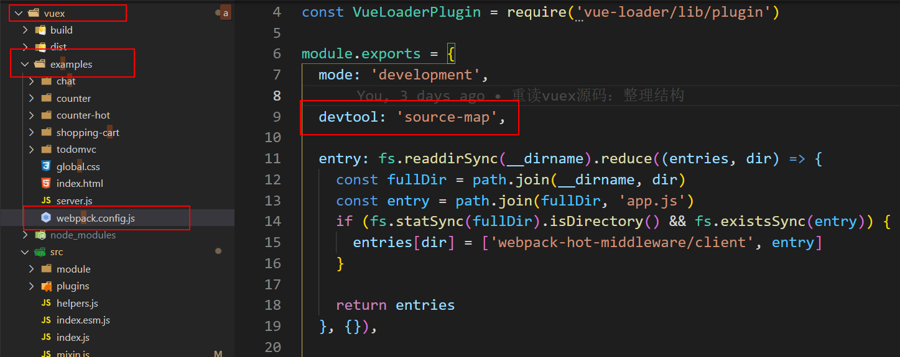
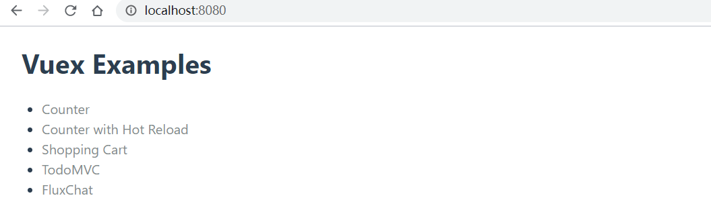
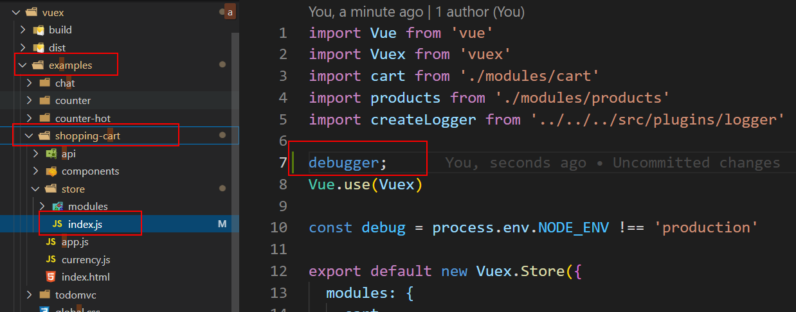

# vuex 源码阅读

当前阅读的 vux 版本 3.1.3。基本源码目录结构：

```
Vuex
├── src                                   源码目录
│   ├── module                            与模块 module 相关的操作
│   │   ├── module-collection.js          用于递归收集并注册根模块和嵌套模块
│   │   └── module.js                     定义 Module 类，存储模块内的一些信息，例如: state...
│   ├── plugins                           插件
│   │   ├── devtool.js                    用于 devtool 调试
│   │   └── logger.js                     日志
│   ├── helpers.js                        辅助函数，例如：mapState、mapGetters、mapMutations...
│   ├── index.esm.js                      es6 module 打包入口
│   ├── index.js                          入口文件
│   ├── mixin.js                          通过 mixin 将 vuex 全局混入
│   ├── store.js                          定义了 Store 类，核心
│   ├── util.js                           工具函数
```


## 调试方式

1. 将 vuex 源码 clone 下来

2. 修改 `vuex/examples/webpack.config.js`，添加一行代码 `devtool: 'source-map'`

   

3. 在 vuex 根目录执行 `npm install` 装包，后运行 `npm run dev`，打开 `http://localhost:8080`，就可以利用 vuex 的 example 示例进行调试

   

4. 在 examples 里面对应的示例打 debugger 即可，例如这里利用 shopping-cart 示例进行调试（或者在源码内部进行 debugger）

   


## 1、Vue.use 安装 Vuex

首先，来看看在 vue 中使用 vuex 的初始化工作：

```js
import Vue from 'vue'
import Vuex from 'vuex'

Vue.use(Vuex)

const store = new Vuex.Store({
  state: {
    count: 0
  },
  mutations: {
    increment (state) {
      state.count++
    }
  }
})

export default store
```

然后在 main.js 中：

```js
import store from './store'

new Vue({
  el: '#app',
  store
})
```


一开始，就是执行了 `Vue.use(Vuex)` 安装 Vuex


### 1-1、Vue.use

简单回顾一下 Vue.use：

```js
// 用于安装 vue 插件：
//   1、检查插件是否安装，如果安装了就不再安装
//   2、如果没有没有安装，安装插件，执行插件的 install 方法
export function initUse(Vue: GlobalAPI) {
  // 接受一个 plugin 参数
  Vue.use = function (plugin: Function | Object) {
    // this 就是 Vue 本身
    // _installedPlugins 存储了所有 plugin
    // installedPlugins 与 this._installedPlugins 指向同一个数组
    // 那么只要 installedPlugins 或者 this._installedPlugins 其中一个改变，肯定会影响另外一个
    const installedPlugins =
      this._installedPlugins || (this._installedPlugins = []);

    // 如果 plugin 在 installedPlugins 已存在，那么返回 Vue（说明安装过，不再重复安装）
    if (installedPlugins.indexOf(plugin) > -1) {
      return this;
    }

    // additional parameters
    const args = toArray(arguments, 1);
    // 将 Vue 实例放到参数数组的首位，后面将这些参数传递给 install 方法
    args.unshift(this);

    if (typeof plugin.install === "function") {
      // plugin 是对象形式，执行 plugin.install, args 的第一项就是 Vue
      plugin.install.apply(plugin, args);
    } else if (typeof plugin === "function") {
      // plugin 是函数形式，直接将 plugin 本身当做 install 来执行
      plugin.apply(null, args);
    }

    // 在插件列表 installedPlugins 和 vue._installedPlugins 中添加新安装的插件
    // 因为上面说过 installedPlugins 和 vue._installedPlugins 指向同一个数组
    installedPlugins.push(plugin);

    // 返回 this（即 Vue）
    return this;
  };
}
```

基本上，Vue.use 做的事：

- 检查插件是否安装，如果安装了就不再安装
- 如果没有没有安装，安装插件，执行插件的 install 方法
- 将已安装过的插件保存到 `vue._installedPlugins` 中

并且，接受的参数可以是函数或者对象，如果是函数，那么这个函数本身就是 install，如果是对象，那么就执行对象的 install 方法


再来看看，vuex 的入口文件导出的：

> vuex\src\index.js

```js
import { Store, install } from './store'
import { mapState, mapMutations, mapGetters, mapActions, createNamespacedHelpers } from './helpers'

export default {
  Store,
  install,
  version: '__VERSION__',
  mapState,
  mapMutations,
  mapGetters,
  mapActions,
  createNamespacedHelpers
}
```

导出了一个对象，对象身上有 install 方法，那么 Vue.use 就是执行的这上面的 install 方法


### 1-2、install

> vuex\src\store.js

```js
let Vue // bind on install

// 暴露 install 方法，在 Vue.use(Vuex) 的时候，执行这里的 install 方法
function install (_Vue) {
  // Vue 已经存在并且与传入的相等，说明已经使用 Vue.use 安装过 Vuex
  if (Vue && _Vue === Vue) {
    if (process.env.NODE_ENV !== 'production') {
      console.error(
        '[vuex] already installed. Vue.use(Vuex) should be called only once.'
      )
    }
    return
  }

  // 将 Vue.use(Vuex) 时传入的 vue 赋值给 Vue，用于判断是否重复安装 vuex
  Vue = _Vue

  // 如果没有被注册过，调用 applyMixin
  // 执行 mixin 混入，将 $store 对象注入到到每个组件实例
  applyMixin(Vue)
}
```

- 首先会判断 vuex 有没有注册过
- 没有注册过，执行 applyMixin(Vue)


### 1-3、applyMixin

> vuex\src\mixin.js

```js
export default function (Vue) {
  // 获取 vue 的版本
  const version = Number(Vue.version.split('.')[0])

  if (version >= 2) {
    // 通过在每一个组件的 beforeCreate 生命周期混入 vuexInit
    // vuexInit 就是使每个 Vue 的实例对象，都有一个 $store 属性
    // 但是注意的是，这里只是将 vuexInit 初始化函数挂载到 beforeCreate 上
    // 真正开始执行 vuexInit 会是：
    //  1、new Vue({ el: '#app', store }) 挂载 vue 根 <App /> 的时候，执行 beforeCreate
    //  2、在每个组件实例化的时候，执行 beforeCreate
    Vue.mixin({
      beforeCreate: vuexInit
    })
  } else {
    // 兼容 vue1.x 版本（不用太过关注）
  }


  // 最终每个 Vue 的实例对象，都有一个 $store 属性。且是同一个 Store 实例
  // 这也是为什么在每一个组件内部都可以通过 this.$store.xxx 调用的原因
  // 在进行组件实例化的时候，通过 new Vue({ el: '#app', store }) 的方式将 store 对象放到 vue.$options 上
  function vuexInit() {
    const options = this.$options
    // store injection
    // store 注入到 Vue 实例中
    // 下面两种做法都是：保证在任意组件访问的 $store 属性都指向同一个 store 对象
    if (options.store) {
      // 若当前组件的 $options 上已存在 store，则将 $options.store 赋值给 this.$store
      // 这个是用于根组件的
      this.$store = typeof options.store === 'function' ?
        options.store() :
        options.store
    } else if (options.parent && options.parent.$store) {
      // 当前组件的 $options 上没有 store，则获取父组件上的 $store，并将其赋值给 this.$store
      // 这个是用于子组件
      this.$store = options.parent.$store
    }
  }
}
```

- 首先，会获取 vue 版本，vuex 会兼容到 vue1.x 版本（这里不讨论 vue1.x 版本的 vuex）
- 当 vue 版本大于 2，通过 `Vue.minxin` 方法做了一个全局的混入，在每个组件 `beforeCreate` 生命周期时会调用 `vuexInit` 方法
- `vuexInit` 方法：
  - 判断当前组件实例的 options 上是否有 store，有，将 $options.store 赋值给 this.$store，这里一般是根组建上面会有 options.store，因为在 `new Vue({ el: '#app', store })` 时将 store 挂载到 options 上
  - options 没有 store，这种一般是子组件，将父组件的 $store拿到，赋值给当前的 this.$store
  - 上面两步，可以做到：保证在任意组件访问的 $store 属性都指向同一个 store 对象


## 2、Vuex.Store 构造类

根据上面的例子，在 `Vue.use(Vuex)` 之后，是：

```js
const store = new Vuex.Store({
  state: {
    count: 0
  },
  mutations: {
    increment (state) {
      state.count++
    }
  }
})
```

通过 `new Vuex.Store()` 的方式得到 store 实例，下面来看看这一步做了什么


 ### 2-1、new Vuex.Store

new Vuex.Store 主要就是执行 Store 构造类的 constructor 构造方法

> vuex\src\store.js

```js
export class Store {
  constructor (options = {}) {
    // 如果是通过 script 标签的方式引入的 vuex，那么直接调用 install 安装，而不需要 Vue.use 安装
    if (!Vue && typeof window !== 'undefined' && window.Vue) {
      install(window.Vue)
    }

    // 开发环境的一些错误提示
    // export function assert (condition, msg) {
    //   if (!condition) throw new Error(`[vuex] ${msg}`)
    // }
    if (process.env.NODE_ENV !== 'production') {
      // 在创建 store 实例之前必须先安装 vuex
      assert(Vue, `must call Vue.use(Vuex) before creating a store instance.`)
      // 当前环境不支持Promise，报错：vuex 需要 Promise polyfill
      assert(typeof Promise !== 'undefined', `vuex requires a Promise polyfill in this browser.`)
      // store 必须使用 new 进行实例化
      assert(this instanceof Store, `store must be called with the new operator.`)
    }

    const {
      plugins = [], // vuex 插件
      // 是否严格模式，默认 false
      // 如果是严格模式，无论何时发生了状态变更且不是由 mutation 函数引起的，都会抛出错误
      strict = false
    } = options

    // 表示提交的状态，当通过 mutations 方法改变 state 时，该状态为 true，state 值改变完后，该状态变为 false; 
    // 在严格模式下会监听 state值 的改变，当改变时，_committing 为 false 时，会发出警告，state 值的改变没有经过 mutations
    // 也就是说，_committing 主要用来判断严格模式下 state 是否是通过 mutation 修改的 state
    this._committing = false
    // 用来存储 actions 方法名称(包括全局和命名空间内的)
    this._actions = Object.create(null)
    // 用来存储 actions 订阅函数
    this._actionSubscribers = []
    // 用来存储 mutations 方法名称(包括全局和命名空间内的)
    this._mutations = Object.create(null)
    // 用来存储 gette
    this._wrappedGetters = Object.create(null)
    // 根据传进来的 options 配置，注册各个模块，构造模块树形结构
    // 注意：此时只是构建好了各个模块的关系，定义了各个模块的 state 状态下
    // 但 getter、mutation 等各个方法还没有注册
    this._modules = new ModuleCollection(options)
    // 存储定义了命名空间的模块
    this._modulesNamespaceMap = Object.create(null)
    // 存放 mutation 的订阅函数
    this._subscribers = []
    // 实例化一个 Vue，主要用 $watch 对 state、getters 进行监听
    this._watcherVM = new Vue()
    // getter 本地缓存
    this._makeLocalGettersCache = Object.create(null)

    // 将 dispatch 和 commit 方法绑定到 store 实例上
    // 避免后续使用 dispatch 或 commit 时改变了 this 指向
    const store = this
    const { dispatch, commit } = this
    this.dispatch = function boundDispatch (type, payload) {
      return dispatch.call(store, type, payload)
    }
    this.commit = function boundCommit (type, payload, options) {
      return commit.call(store, type, payload, options)
    }

    // 严格模式，默认是 false
    // 在 vuex 中，建议所有的 state 的变化都必须经过 mutations 方法，这样才能被 devtool 所记录下来
    // 在严格模式下，未经过 mutations 而直接改变了 state，开发环境下会发出警告
    this.strict = strict

    // 获取 根模块 的 state 值
    const state = this._modules.root.state

    // 初始化根模块，并且递归处理所有子模块
    installModule(this, state, [], this._modules.root)

    // 实现数据的响应式
    // 通过 Vue 生成一个 _vm 实例，将 getter 和 state 交给 _vm 托管，作用：
    //  store.state 赋值给 _vm.data.$$state
    //  getter 通过转化后赋值给 _vm.computed
    //  这样一来，就实现了 state 的响应式，getters 实现了类似 computed 的功能
    resetStoreVM(this, state)

    // 注册插件
    plugins.forEach(plugin => plugin(this))

    // 调试工具注册
    const useDevtools = options.devtools !== undefined ? options.devtools : Vue.config.devtools
    if (useDevtools) {
      devtoolPlugin(this)
    }
  }

  // ...
}
```

1. 判断如果是通过 script 标签的方式引入的 vuex，那么直接调用 install 安装，而不需要 Vue.use 安装
2. 在开发环境下的一些错误提示：
   - 在创建 store 实例前必须先安装 Vuex
   - 当前环境不支持Promise，报错：vuex 需要 Promise polyfill
   - store 必须使用 new 进行实例化
3. 进行一系列属性的初始化，例如：actions、mutations、getters 等，其中最重要的是调用 ModuleCollection 构造 module 对象。这个后面再分析
4. 处理 dispatch 和 commit：改变两个方法中的 this 指向，将其指向当前的 store，避免后续使用 dispatch 或 commit 时改变了 this 指向
5. 调用 installModule 进行根模块处理，并且递归处理各个子模块【后面分析模块化时再分析】
6. 调用 resetStoreVM 进行响应式处理【后面详细分析】
7. 注册插件
8. 调试工具注册

以上，就是 new Vuex.Store 的初始化过程，其中比较重要的是：初始化各种属性、模块化的处理、数据响应式


## 3、modules 模块化

在阅读 modules 模块化源码之前，先来了解一下 vuex 的 modules

> 由于使用单一状态树，应用的所有状态会集中到一个比较大的对象。当应用变得非常复杂时，store 对象就有可能变得相当臃肿。 为了解决以上问题，Vuex 允许我们将 store 分割成模块（module）。每个模块拥有自己的 state、mutation、action、getter、甚至是嵌套子模块——从上至下进行同样方式的分割

可知：modules 主要就是解决所有状态集中在一个文件中，难以管理的问题。


### 3-1、new ModuleCollection

在 new Vuex.Store 初始化 Store 实例的时候说过，会通过 new ModuleCollection 初始化 module 属性：

> vuex\src\store.js

```js
import ModuleCollection from './module/module-collection'

class Store {
  constructor (options = {}) {
    // ...

    this._modules = new ModuleCollection(options)
  }
}
```

new ModuleCollection 的时候会将 options 当做参数，options 是 { state, mutations, actions, getters, modules } 这个对象

```js
const store = new Vuex.Store({
  state: {
    count: 0
  },
  mutations: {
    increment (state) {
      state.count++
    }
  }
})
```


接下来就看看 new ModuleCollection 的过程

> vuex\src\module\module-collection.js

```js
class ModuleCollection {
  constructor (rawRootModule) {
    // 注册根模块，并递归注册子模块
    // rawRootModule = { state:{}, getters:{}, mutations:{}, actions:{}, modules:{} }
    this.register([], rawRootModule, false)
  }

  // ...
}
```


#### 3-1-1、register 注册模块

> vuex\src\module\module-collection.js

```js
class ModuleCollection {
  constructor (rawRootModule) {
    // 注册根模块，并递归注册子模块
    // rawRootModule = { state:{}, getters:{}, mutations:{}, actions:{}, modules:{} }
    this.register([], rawRootModule, false)
  }


  // 注册根模块，并递归注册子模块
  // rawModule = { state:{}, getters:{}, mutations:{}, actions:{}, modules:{} }
  register (path, rawModule, runtime = true) {
    // 非生产环境 断言判断用户自定义的模块是否符合要求
    if (process.env.NODE_ENV !== 'production') {
      assertRawModule(path, rawModule)
    }

    // 创建一个新模块
    const newModule = new Module(rawModule, runtime)

    if (path.length === 0) {
      // 在执行构造器函数 constructor 时： this.register([], rawRootModule, false)
      // 说明：根模块，path 是空数组 []，将根模块挂载到 this.root
      this.root = newModule
    } else {
      // 如果是子模块，进到这里
      // 首先，找到子模块的父模块
      // [1].slice(0, -1) 结果是：[]，代表父模块是 根模块，1 就是当前子摸快
      //   如果是 [1, 2]， 结果是: [1]，代表父模块是 1，1 的父模块是 根模块
      //   因为在 vuex 中，modules 里面还可以嵌套 modules
      const parent = this.get(path.slice(0, -1))
      // 将子模块添加到父模块的 _children 上；newModule 是根据当前子模块创建的
      // 实际上就是类似：parent: { _children: { 当前子模块名: newModule } }
      parent.addChild(path[path.length - 1], newModule)
    }

    // register nested modules
    // 递归 modules 进行子模块注册
    if (rawModule.modules) {
      // export function forEachValue (obj, fn) {
      //   Object.keys(obj).forEach(key => fn(obj[key], key))
      // }
      forEachValue(rawModule.modules, (rawChildModule, key) => {
        // 如果还有 modules，递归注册
        this.register(path.concat(key), rawChildModule, runtime)
      })
    }
  }
}
```

register 的主要逻辑：

1. 根据当前模块对象 rawModule，通过 `new Module` 的形式，创建一个模块实例 `newModule`

2. 判断 `path.length === 0` 条件成立，那么当前模块为`根模块`，将 `this.root` 指向刚刚创建的模块实例 `newModule`

3. `path.length === 0` 条件不成立，那么当前为子模块，通过 `this.get` 找到父模块，然后调用父模块中的 `addChild` 方法将当前模块添加到子模块中

4. 最后判断当前模块是否还有嵌套的模块，有的话就重新回到第1步进行递归操作 ; 否则不做任何处理


#### 3-1-2、new Module

先从 `new Module` 创建一个模块实例开始：

```js
const newModule = new Module(rawModule, runtime)
```

- rawModule：当前模块对象，里面类似 `{ state:{}, getters:{}, mutations:{}, actions:{}, modules:{} }`
- runtim：是否运行时


> vuex\src\module\module.js

```js
import { forEachValue } from '../util'

// Base data struct for store's module, package with some attribute and method
export default class Module {
  // rawModule = { state:{}, getters:{}, mutations:{}, actions:{}, modules:{} }
  constructor (rawModule, runtime) {
    this.runtime = runtime

    // 创建一个 _children 对象，用来存储当前模块的子模块
    this._children = Object.create(null)

    // 当前模块对象：{ state:{}, getters:{}, mutations:{}, actions:{}, modules:{} }
    this._rawModule = rawModule

    const rawState = rawModule.state

    // 存储当前模块的 state 状态：1. 函数类型 => 返回一个obj对象; 2. 直接获取到obj对象
    this.state = (typeof rawState === 'function' ? rawState() : rawState) || {}
  }

  // 是否开启了命名空间，是，返回 true
  get namespaced () {
    return !!this._rawModule.namespaced
  }

  // 往当前模块添加子模块
  addChild (key, module) {
    this._children[key] = module
  }

  // 根据 key 移除子模块
  removeChild (key) {
    delete this._children[key]
  }

  // 根据 key 获取子模块
  getChild (key) {
    return this._children[key]
  }

  // 根据 key 判断是否存在子模块
  hasChild (key) {
    return key in this._children
  }

  // 将当前模块的命名空间更新到指定模块的命名空间中
  // 并更新 actions、mutations、getters 的调用来源
  update (rawModule) {
    this._rawModule.namespaced = rawModule.namespaced
    if (rawModule.actions) {
      this._rawModule.actions = rawModule.actions
    }
    if (rawModule.mutations) {
      this._rawModule.mutations = rawModule.mutations
    }
    if (rawModule.getters) {
      this._rawModule.getters = rawModule.getters
    }
  }

  // 遍历当前模块的所有子模块，并执行回调函数
  forEachChild (fn) {
    forEachValue(this._children, fn)
  }

  // 遍历当前模块所有的 getters，并执行回调函数
  forEachGetter (fn) {
    if (this._rawModule.getters) {
      forEachValue(this._rawModule.getters, fn)
    }
  }

  // 遍历当前模块所有的 actions，并执行回调函数
  forEachAction (fn) {
    if (this._rawModule.actions) {
      forEachValue(this._rawModule.actions, fn)
    }
  }

  // 遍历当前模块所有的 mutations，并执行回调函数
  forEachMutation (fn) {
    if (this._rawModule.mutations) {
      forEachValue(this._rawModule.mutations, fn)
    }
  }
}
```

`new Module` 做的事情很简单：

- 定义了 `this.runtime` 
- 定义了 `this._children` 用于存放当模块的子模块
- 定义了 `this._rawModule` 用于存放当前模块对象信息 `{ state:{}, getters:{}, mutations:{}, actions:{}, modules:{} }`
- 定义了 `this.state` 就是 `this._rawModule.state`

可以发现，在 `constructor` 构造函数里面，也就是 `new Module` 的时候，并没有定义 `getters`、`mutations`、`actions` 的；例如现在是无法通过 `Module.mutations` 获取到该模块所有的 `mutations` 方法；这三个会等模块全部都收集完毕以后才进行操作

其他的就是提供了很多操作 module 的方法


辅助遍历函数 `forEachValue`

> vuex\src\util.js

```js
// 遍历对象，并执行回调
function forEachValue (obj, fn) {
  Object.keys(obj).forEach(key => fn(obj[key], key))
}
```


### 3-2、installModule 处理模块树

回到 `Store` 类，接下来就是 installModule 去处理创建出来的模块树

> vuex\src\store.js

```js
class Store {
  constructor (options = {}) {
    // ...
    this._modules = new ModuleCollection(options)

    // ...
    // 获取 根模块 的 state 值
    const state = this._modules.root.state

    // 从根模块开始，递归完善各个模块的信息：
    installModule(this, state, [], this._modules.root)
  }
}
```

调用了 `installModule` 方法，并将 `store` 实例对象 、`state` 属性 、路径 、根模块对象依次作为参数进行传递


来看看 `installModule` 方法

> vuex\src\store.js

```js
/**
 * @param {*} store store 实例
 * @param {*} rootState 根模块的 state
 * @param {*} path 路径
 * @param {*} module 模块
 * @param {*} hot 是否热重载
 */
function installModule (store, rootState, path, module, hot) {
  // 从 Store 构造函数中，我们可以看到 根模块 传入的 path 是一个空数组
  const isRoot = !path.length
  // 获取当前模块的命名空间
  // 如果子模块没有设置命名空间，子模块会继承父模块的命名空间
  const namespace = store._modules.getNamespace(path)

  // register in namespace map
  // 如果当前模块设置了namespaced 或 继承了父模块的namespaced
  // 则在 _modulesNamespaceMap 中存储一下当前模块，便于之后的辅助函数可以调用
  if (module.namespaced) {
    // 防止命名空间重复
    if (store._modulesNamespaceMap[namespace] && process.env.NODE_ENV !== 'production') {
      console.error(`[vuex] duplicate namespace ${namespace} for the namespaced module ${path.join('/')}`)
    }
    // 在 _modulesNamespaceMap 中存储 namespace - module【模块名】 键值对
    store._modulesNamespaceMap[namespace] = module
  }

  // 如果不是 根模块，那么将当前模块的 state 注册到父模块的 state 上
  if (!isRoot && !hot) {
    // 获取父模块的 state
    const parentState = getNestedState(rootState, path.slice(0, -1))
    // 当前模块名
    const moduleName = path[path.length - 1]
    store._withCommit(() => {
      if (process.env.NODE_ENV !== 'production') {
        if (moduleName in parentState) {
          console.warn(
            `[vuex] state field "${moduleName}" was overridden by a module with the same name at "${path.join('.')}"`
          )
        }
      }
      // 将当前模块的 state 注册在父模块的 state 上，并且使用的是 Vue.set，所以是响应式的，结果类似：
      // {
      //   state: {
      //     msg: 'xxx'
      //     moduleA: { // cart 模块下的 state
      //       items: []
      //     }
      //  }
      // }
      // 在后面响应式处理的时候，会将 state 挂载到 vue 上
      // 所以，既可以通过 this.$store.state.moduleA.items 访问到
      Vue.set(parentState, moduleName, module.state)
    })
  }

  // 设置当前模块的上下文 context
  // 根据命名空间为每个模块创建了一个属于该模块调用的上下文
  // 并将该上下文赋值了给了该模块的 context 属性
  // 该上下文中有当前模块的 dispatch、commit、getters、state
  const local = module.context = makeLocalContext(store, namespace, path)

  // 注册 mutation
  module.forEachMutation((mutation, key) => {
    const namespacedType = namespace + key
    registerMutation(store, namespacedType, mutation, local)
  })

  // 注册 action
  module.forEachAction((action, key) => {
    const type = action.root ? key : namespace + key
    const handler = action.handler || action
    registerAction(store, type, handler, local)
  })

  // 注册 getter
  module.forEachGetter((getter, key) => {
    const namespacedType = namespace + key
    registerGetter(store, namespacedType, getter, local)
  })

  // 递归处理子模块
  module.forEachChild((child, key) => {
    installModule(store, rootState, path.concat(key), child, hot)
  })
}
```

installModule 逻辑梳理：

- 获取当前模块的命名空间
- 如果不是 根模块，那么将当前模块的 state 注册到父模块的 state 上
- 设置当前模块的上下文context
- 注册 `mutation`、`action`、`getter`
- 递归处理所有子模块


下面来逐个解析上面的流程。


#### 3-2-1、获取当前模块的命名空间

> vuex\src\store.js

```js
function installModule (store, rootState, path, module, hot) {
  const namespace = store._modules.getNamespace(path) 
}
```

是将路径 `path` 作为参数， 调用 `ModuleCollection` 类实例上的 `getNamespace` 方法来获取当前注册对象的命名空间

> vuex\src\module\module-collection.js

```js
class ModuleCollection {
  // ...

  /**
  * 根据模块是否有命名空间来设定一个路径名称
  * 例如：A 为父模块，B 为子模块:
  *   若 A 模块命名空间为 moduleA, B 模块未设定命名空间时; 则 B 模块继承 A 模块的命名空间，为 moduleA/
  */
  getNamespace (path) {
    let module = this.root
    return path.reduce((namespace, key) => {
      module = module.getChild(key)
      return namespace + (module.namespaced ? key + '/' : '')
    }, '')
  }
}
```

从这可以看出，未指定命名空间的模块会继承父模块的命名空间。


#### 3-2-2、将子模块的 state 挂到父模块的 state 上

> vuex\src\store.js

```js
function installModule (store, rootState, path, module, hot) {
  // ...
    
  // 如果不是 根模块，那么将当前模块的 state 注册到父模块的 state 上
  if (!isRoot && !hot) {
    // 获取父模块的 state
    const parentState = getNestedState(rootState, path.slice(0, -1))
    // 当前模块名
    const moduleName = path[path.length - 1]

    store._withCommit(() => {
      if (process.env.NODE_ENV !== 'production') {
        if (moduleName in parentState) {
          console.warn(
            `[vuex] state field "${moduleName}" was overridden by a module with the same name at "${path.join('.')}"`
          )
        }
      }

      // 将当前模块的 state 注册在父模块的 state 上，并且使用的是 Vue.set，所以是响应式的，结果类似：
      // {
      //   state: {
      //     msg: 'xxx'
      //     moduleA: { // cart 模块下的 state
      //       items: []
      //     }
      //   }
      // }
      // 在后面响应式处理的时候，会将 state 挂载到 vue 上
      // 所以，既可以通过 this.$store.state.moduleA.items 访问到
      Vue.set(parentState, moduleName, module.state)
    })
  }
}
```

主要就是将非 `根模块` 的 state 注册到 `根模块` 上：

- 获取父模块的 state：

  > vuex\src\store.js

  ```js
  const parentState = getNestedState(rootState, path.slice(0, -1))
  
  
  function getNestedState (state, path) {
    return path.reduce((state, key) => state[key], state)
  }
  ```

  getNestedState 的作用：根据当前的模块路径，从根模块的 `state` 开始找，最终找到当前模块的父模块的 `state`

- 得到当前模块名

  ```js
  // 当前模块名
  const moduleName = path[path.length - 1]
  ```

  `path[path.length - 1]`，最后一个为当前模块，基本格式是： `[父模块，子模块]`

- 将当前模块的 `state` 响应式地添加到了父模块的 `state` 上

  ```js
  // 将当前模块的state注册在父模块的state上，并且是响应式的
  Vue.set(parentState, moduleName, module.state)
  ```

  用了 `Vue` 的 `set` 方法将当前模块的 `state` 响应式地添加到了父模块的 `state` 上，这是因为在之后我们会看到 `state` 会被放到一个新的 `Vue` 实例的 `data` 中，所以这里不得不使用 `Vue` 的 `set` 方法来响应式地添加。得到的结果类似：

  ```js
  {
    state: {
       msg: 'xxx'
       moduleA: { // cart 模块下的 state
         items: []
       }
    }
  }
  ```

  这也就是为什么在获取子模块上 `state` 的属性时，是通过 `this.$store.state.moduleA.items` 这样的形式来获取


#### 3-2-3、设置当前模块的上下文 context

> vuex\src\store.js

```js
function installModule (store, rootState, path, module, hot) {
  // ...

  const local = module.context = makeLocalContext(store, namespace, path)
}
```

这行代码是非常核心的一段代码，它根据命名空间为每个模块创建了一个属于该模块调用的上下文，并将该上下文赋值了给了该模块的 `context` 属性，该上下文中有当前模块的 dispatch、commit、getters、state


看看 makeLocalContext 逻辑：

> vuex\src\store.js

```js
function makeLocalContext (store, namespace, path) {
  // 判断有没有使用命名空间
  const noNamespace = namespace === ''

  const local = {
    // 没有命名空间，直接使用根模块的 dispatch
    // 如果有命名空间，需要对 type 进行处理一下，因为有命名空间的 type 应该是 moduleA/xxxx 形式
    // 其实，本质上，最后都是调用的 根模块 的 store.dispatch，只是有命名空间的，需要处理一下 type
    //   store._mutations = {
    //     'mutationFun': [function handler() {...}],
    //     'ModuleA/mutationFun': [function handler() {...}, function handler() {...}],
    //     'ModuleA/ModuleB/mutationFun': [function handler() {...}]
    //   }
    dispatch: noNamespace ? store.dispatch : (_type, _payload, _options) => {
      const args = unifyObjectStyle(_type, _payload, _options)
      const { payload, options } = args
      let { type } = args

      if (!options || !options.root) {
        type = namespace + type
        if (process.env.NODE_ENV !== 'production' && !store._actions[type]) {
          console.error(`[vuex] unknown local action type: ${args.type}, global type: ${type}`)
          return
        }
      }

      return store.dispatch(type, payload)
    },

    // 没有命名空间，直接使用根模块的 commit
    // 有命名空间，需要对 type 进行处理一下，才能拿到正确的
    // 本质也是调用的 根模块 的 store.commit
    //   store._actions = {
    //     'ationFun': [function handler() {...}],
    //     'ModuleA/ationFun': [function handler() {...}, function handler() {...}],
    //     'ModuleA/ModuleB/ationFun': [function handler() {...}]
    //   }
    commit: noNamespace ? store.commit : (_type, _payload, _options) => {
      const args = unifyObjectStyle(_type, _payload, _options)
      const { payload, options } = args
      let { type } = args

      if (!options || !options.root) {
        type = namespace + type
        if (process.env.NODE_ENV !== 'production' && !store._mutations[type]) {
          console.error(`[vuex] unknown local mutation type: ${args.type}, global type: ${type}`)
          return
        }
      }

      store.commit(type, payload, options)
    }
  }

  // getters and state object must be gotten lazily
  // because they will be changed by vm update
  // 通过 Object.defineProperties 方法对 local 的 getters 属性和 state 属性设置了一层获取代理
  // 等后续对其访问时，才会进行处理
  Object.defineProperties(local, {
    getters: {
      // 没有命名空间，直接读取 store.getters（store.getters 已经挂载到 vue 实例的 computed 上了）
      // 有命名空间，从本地缓存 _makeLocalGettersCache 中读取 getters
      get: noNamespace
        ? () => store.getters
        : () => makeLocalGetters(store, namespace)
    },
    state: {
      get: () => getNestedState(store.state, path)
    }
  })

  return local
}
```

- 当前模块上下文 context 中的 dispatch、commit 本质都是调用 store 的 dispatch、commit 方法，只不过在开启 namespace 之后，对 type 做了处理，拼接上了 namespace，以保证在 store.\_actions、store.\_mutations 对象中能找到对应的方法

- 通过 Object.defineProperties 方法对 local 的 getters 属性和 state 属性设置了一层获取代理

  - getter 通过 namespace （本质的是 moduleName 的集合） 寻找对应 module 下的 getter

    > vuex\src\store.js

    ```js
    function makeLocalGetters (store, namespace) {
      // 若缓存中没有指定的 getters，则创建一个新的 getters 缓存到 _makeLocalGettersCache 中
      if (!store._makeLocalGettersCache[namespace]) {
        const gettersProxy = {}
        const splitPos = namespace.length
        Object.keys(store.getters).forEach(type => {
          // skip if the target getter is not match this namespace
          if (type.slice(0, splitPos) !== namespace) return
    
          const localType = type.slice(splitPos)
    
          // 对 getters 添加一层代理
          Object.defineProperty(gettersProxy, localType, {
            get: () => store.getters[type],
            enumerable: true
          })
        })
        // 把代理过的 getters 缓存到本地
        store._makeLocalGettersCache[namespace] = gettersProxy
      }
    
      // 若缓存中有指定的getters，直接返回
      return store._makeLocalGettersCache[namespace]
    }
    ```

    有命名空间时访问 `local.getters` ，首先会去 `store._makeLocalGettersCache` 查找是否有对应的 `getters` 缓存，若没有，则创建一个 `gettersProxy` ，在 `store.getters` 上找到对应的 `getters` ，然后用 `Object.defineProperty` 对 `gettersProxy` 做一层处理，即当访问 `local.getters.func` 时，相当于访问了 `store.getters['first/func']` ，这样做一层缓存，下一次访问该 `getters` 时，就不会重新遍历 `store.getters` 了 ; 若有缓存，则直接从缓存中获取

  - state 则是直接通过 path （本质也是 moduleName 的集合）逐层寻找对应 module 下的 state

    > vuex\src\store.js

    ```js
    function getNestedState (state, path) {
      return path.reduce((state, key) => state[key], state)
    }
    ```


#### 3-3-4、遍历注册 mutation

> vuex\src\store.js

```js
function installModule (store, rootState, path, module, hot) {
  // ...

  // 遍历注册所有 mutation
  module.forEachMutation((mutation, key) => {
    // namespacedType = 命名空间加 mutation 方法名
    // 例如，有模块 user，下面有 mutation 方法 getName
    // 得到的 namespacedType 就是 user/getName
    const namespacedType = namespace + key

    // 调用 registerMutation 注册 mutations 方法
    registerMutation(store, namespacedType, mutation, local)
  })
}
```

- 拼接得到 `namespacedType`，格式：`moduleA/getName`
- 调用 registerMutation 注册 mutations 方法

具体看看 registerMutation 函数

> vuex\src\store.js

```js
// 注册 mutation
function registerMutation (store, type, handler, local) {
  // 根据传入的 type 也就是 namespacedType 去 store._mutations 对象中寻找是否存在
  // 若存在则直接获取；否则就创建一个空数组用于存储 mutations 方法
  // 实际上类似：
  //   store._mutations = {
  //     'mutationFun': [function handler() {...}],
  //     'ModuleA/mutationFun': [function handler() {...}, function handler() {...}],
  //     'ModuleA/ModuleB/mutationFun': [function handler() {...}]
  //   }
  const entry = store._mutations[type] || (store._mutations[type] = [])

  // 将当前的 mutation 方法函数添加到数组末尾
  entry.push(function wrappedMutationHandler (payload) {
    handler.call(store, local.state, payload)
  })
}
```

主要作用就是将 mutation 方法添加到 `store._mutations` 对应模块下面

问题：为什么使用数组存放？

假设父模块 `ModuleA` 里有一个叫 `func` 的 `mutations` 方法，那么有：

```js
store._mutations = {
  'ModuleA/func': [function handler() {...}]
}
```

前面说过，如果子模块没有设置命名空间，那么他是会继承父模块的命名空间的。那么子模块也有一个 `func` 的 `mutations` 方法，那么为了保证父模块的 `func` 方法不被替换，就应该添加到数组的末尾。后续如果调用该 `mutations` 方法，会先获取到相应的数组，然后遍历执行

**所以：`mutations` 方法在同一模块内是可以重名的**


#### 3-3-5、遍历注册 action

> vuex\src\store.js

```js
function installModule (store, rootState, path, module, hot) {
  // ...

  // 注册 action
  module.forEachAction((action, key) => {
    /**
     * action 有两种写法：
     *  actions: {
     *     setName(context, payload) {},
     *     setAge: {
     *       root: true,
     *       handler(context, payload) {}
     *     }
     *  }
     */
    // root = true，代表将这个 actions 方法注册到全局上，即前面不加上任何的命名空间前缀
    // 否则，得到的类似 moduleA/actionFunc，根模块的 namespace 是 ''，那么直接是 actionFunc
    const type = action.root ? key : namespace + key
    // 获取 actions 方法对应的函数
    const handler = action.handler || action

    // 调用 registerAction 注册 action
    registerAction(store, type, handler, local)
  })
}
```

- 兼容处理两种 action 写法
- 调用 registerAction 注册 action

具体看看 registerAction 逻辑：

> vuex\src\store.js

```js
// 注册 action
function registerAction (store, type, handler, local) {
  // 根据传入的 type 也就是 namespacedType 去 store._actions 对象中寻找是否存在
  // 若存在则直接获取；否则就创建一个空数组用于存储 actions 方法
  //   store._actions = {
  //     'ationFun': [function handler() {...}],
  //     'ModuleA/ationFun': [function handler() {...}, function handler() {...}],
  //     'ModuleA/ModuleB/ationFun': [function handler() {...}]
  //   }
  // 同样，actions 的方法名在同一模块内也是可以重名的，原理与 mutations 一致
  const entry = store._actions[type] || (store._actions[type] = [])

  entry.push(function wrappedActionHandler (payload) {
    let res = handler.call(store, {
      dispatch: local.dispatch,
      commit: local.commit,
      getters: local.getters,
      state: local.state,
      rootGetters: store.getters,
      rootState: store.state
    }, payload)

    // 判断 actions 返回值是不是 promise，不是，将结果包裹在 promise 返回
    // 因为 action 是异步的，那么也希望其返回值是一个 promise 对象，方便后续的操作
    if (!isPromise(res)) {
      res = Promise.resolve(res)
    }
    if (store._devtoolHook) {
      return res.catch(err => {
        store._devtoolHook.emit('vuex:error', err)
        throw err
      })
    } else {
      return res
    }
  })
}
```

action 的注册与 mutation 类似，但是由于 action 是异步的，所以会判断 action 的执行结果是不是 promise，如果不是，包裹在 promise 中返回；

**同样，action 的方法名在同一模块内也是可以重名的，原理与 mutation 一致**


#### 3-3-6、遍历注册 getter

> vuex\src\store.js

```js
function installModule (store, rootState, path, module, hot) {
  // ...

  // 注册 getter
  module.forEachGetter((getter, key) => {
    // 得到 namespacedType 类似 moduleA/getterFunc；根模块的 namespace 是 ''，那么直接是 getterFunc
    const namespacedType = namespace + key

    // 调用 registerGetter 注册 getter
    registerGetter(store, namespacedType, getter, local)
  })
}
```

- 拼接得到 namespacedType，格式类似：`moduleA/getterFunc`
- 调用 registerGetter 注册 getter

具体看看 registerGetter 逻辑：

> vuex\src\store.js

```js
// 注册 getter
function registerGetter (store, type, rawGetter, local) {
  // 判断 getter 在同一模块内不能重名
  if (store._wrappedGetters[type]) {
    if (process.env.NODE_ENV !== 'production') {
      console.error(`[vuex] duplicate getter key: ${type}`)
    }
    return
  }

  // 在 store._wrappedGetters 中存储 getters
  store._wrappedGetters[type] = function wrappedGetter (store) {
    // rawGetter 就是每一个 getters 的方法函数
    return rawGetter(
      local.state, // local state 当前模块的 state
      local.getters, // local getters 当前模块的 getters
      store.state, // root state 根模块的 state
      store.getters // root getters 根模块的 getters
    )
  }
}
```

- 判断 getter 在同一模块内不能重名
- 在 store._wrappedGetters 中存储 getters 方法


#### 3-3-7、递归注册子模块

> vuex\src\store.js

```js
function installModule (store, rootState, path, module, hot) {
  // ...

  // 递归处理子模块
  module.forEachChild((child, key) => {
    installModule(store, rootState, path.concat(key), child, hot)
  })
}
```

installModule 最后一步就是递归去处理每一个子模块。


## 4、resetStoreVM 响应式

回到 Store 类的 constructor 构造器函数中，在执行完 installModule 模块注册之后，就是调用 resetStoreVM 进行响应式处理。

> vuex\src\store.js

```js
class Store {
  constructor (options = {}) {
    // ...

    // 获取 根模块 的 state 值
    const state = this._modules.root.state

    // 实现数据的响应式
    // this：当前 store 实例； state：根模块的 state
    resetStoreVM(this, state)
  }
}
```

resetStoreVM 逻辑：通过 Vue 生成一个 _vm 实例，将 getter 和 state 交给 _vm 托管

- store.state 赋值给 _vm.data.$$state
- getter 通过转化后赋值给 _vm.computed
- 这样一来，就实现了 state 的响应式，getters 实现了类似 computed 的功能


接下来就分析 resetStoreVM 这个函数：

> vuex\src\store.js

```js
// 将 state、getter 转化为响应式
function resetStoreVM (store, state, hot) {
  // 保存一份老的 vm 实例
  const oldVm = store._vm

  // bind store public getters
  // 初始化 store 中的 getters【注意：之前模块注册时 getters 是存放在 store._wrappedGetters 中的】
  store.getters = {}
  // reset local getters cache
  // 重置本地 getters 缓存
  store._makeLocalGettersCache = Object.create(null)
  // 拿到模块注册时存储的 getters
  const wrappedGetters = store._wrappedGetters
  // 声明 计算属性 computed 对象
  const computed = {}
  // function forEachValue (obj, fn) {
  //   Object.keys(obj).forEach(key => fn(obj[key], key))
  // }
  // 遍历 wrappedGetters 中存储的 getters 
  forEachValue(wrappedGetters, (fn, key) => {
    // use computed to leverage its lazy-caching mechanism
    // direct inline function use will lead to closure preserving oldVm.
    // using partial to return function with only arguments preserved in closure environment.

    // function partial (fn, arg) {
    //   return function () {
    //     return fn(arg)
    //   }
    // }
    // 将 wrappedGetters 赋值到 computed 上
    // 后面会将这个 computed 对象挂到 vue 上
    computed[key] = partial(fn, store)

    // 将每一个 getter 方法注册到 store.getters，访问对应 getter 方法时触发 get 去 vm 上访问对应的 computed
    // vm 的 computed 在下面会被挂载
    Object.defineProperty(store.getters, key, {
      get: () => store._vm[key],
      enumerable: true // 可枚举
    })
  })

  // use a Vue instance to store the state tree
  // suppress warnings just in case the user has added
  // some funky global mixins
  const silent = Vue.config.silent
  Vue.config.silent = true

  // new 一个 Vue 实例对象，运用 Vue 内部的响应式实现注册 state 以及 computed
  // 所以 Vuex 和 Vue 是强绑定的
  // 通过构造 Vue 实例，将 store.state 属性设置为 data 数据，将 store.getter 集合设置为 computed 属性实现了响应式
  store._vm = new Vue({
    data: {
      $$state: state
    },
    computed
  })
  Vue.config.silent = silent

  // enable strict mode for new vm
  // 如果使用了严格模式，那么要求 state 只能通过 mutation 修改
  if (store.strict) {
    enableStrictMode(store)
  }

  // 如果存在旧的 vm 实例，销毁旧的 vm 实例：因为生成了新的 vm 实例
  if (oldVm) {
    if (hot) {
      // dispatch changes in all subscribed watchers
      // to force getter re-evaluation for hot reloading.
      // 卸载对 state 的引用
      store._withCommit(() => {
        oldVm._data.$$state = null
      })
    }
    // 销毁旧的 vm 实例
    Vue.nextTick(() => oldVm.$destroy())
  }
}
```

主要做的事：

- 生成一个 `Vue` 的实例 `_vm` ，然后将 `store._makeLocalGettersCache` 里的 `getters` 以及 `store.state` 交给一个 `_vm` 托管，即将 `store.state` 赋值给 `_vm.data.$$state` ，将 `store._makeLocalGettersCache` 通过转化后赋值给 `_vm.computed` ，这样一来，`state` 就实现了响应式，`getters` 实现了类似 `computed` 的功能

- 并且，对 store.getters 进行了代理，后续通过 store.getters 访问到 getter 实际上是  `store._makeLocalGettersCache` 通过转化后赋值给挂载在 vm 上的 computed


经过上面的处理，已经知道 getter 可以通过 `this.$store.getter.某个getters` 的形式来使用 getters 了，那么 state 又该如何使用呢？其实在 `Store` 类中定义了一个 `get` 函数，用于处理 `this.$store.state` 的操作：

> vuex\src\store.js

```js
class Store {
  constructor() {...}

  // 访问 state，实际上就是访问 store._vm.data.$$state
  // 在 resetStoreVM 响应式处理的时候会将 state 挂载到 store._vm.data.$$state
  get state () {
    return this._vm._data.$$state
  }
}
```

当去访问 `store.state` 时，实际上是去访问 `store._vm.data.$$state` 


